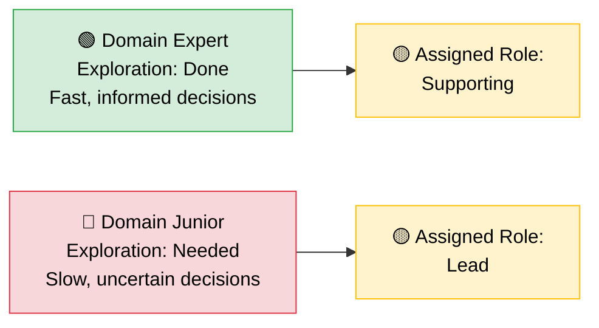
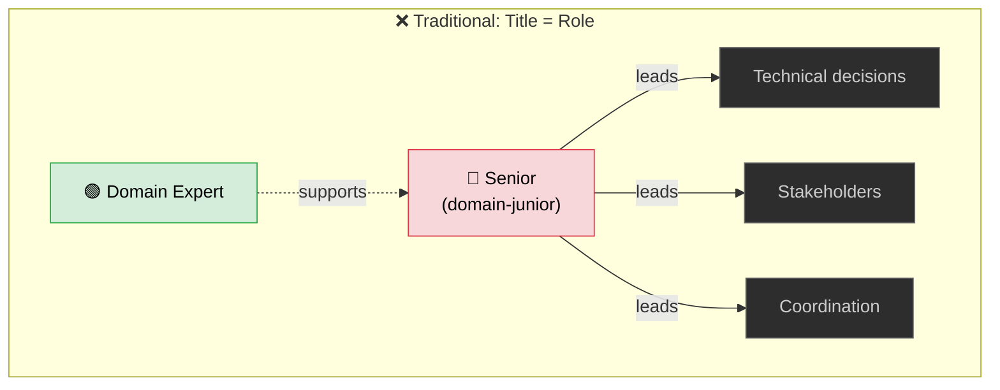
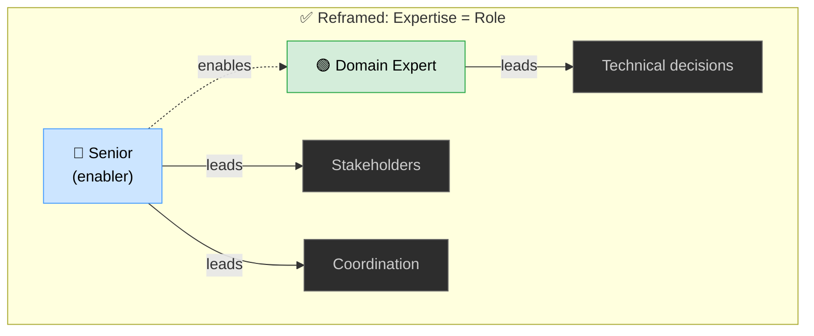

  

A new project kicks off — migrating a critical system to a platform nobody on the team has used before. Well, almost nobody. There's one person who's built on it. Shipped production workloads. Knows the failure modes.

They don't get the lead. The person with the most years of experience does. The senior. The one with the title.

Everyone defers. The titled lead chairs the meetings, makes the architecture calls, approves the designs. The person who actually knows the platform sits three rows back on the call, unmuted only when asked a direct question.

Six weeks later, the project is behind. Decisions are being revisited. The team is frustrated but can't quite name why.

You've seen this movie. Maybe you've been in it. Maybe you've been on both sides.

<!-- truncate -->

## The Default: Title = Lead

Here's the unspoken assumption: if someone is senior, they must be competent at *everything*. Years of experience becomes a universal proxy for expertise. Ten years in the industry? You can lead anything.

Except — why would you, when someone on the team already knows it? They could learn it, sure. But the team already has someone who's been there, built on it, and knows where the landmines are. The question isn't capability. It's opportunity cost.

Patrick Lencioni's *The Five Dysfunctions of a Team* describes the foundation that high-performing teams are built on: **vulnerability-based trust** — the ability to admit what you don't know without it being used against you. When a senior is handed the lead in an unfamiliar domain, the incentive structure works against that honesty. Admitting "I don't know this space" feels like admitting you don't deserve your title. So you wing it.

And the team? They see the title. They don't push back. Lencioni calls this **fear of conflict** — not shouting matches, but the healthy act of challenging ideas regardless of who proposed them. The team's silence isn't agreement. It's avoidance.

  

The dysfunction isn't that the senior person is incompetent. It's that the system made it impossible for anyone to say the obvious: *you're junior here*.

## The Map Is Not the Territory

**Expertise doesn't transfer the way we pretend it does.**

Donella Meadows, in *Thinking in Systems*, describes how every system has its own feedback loops, delays, and leverage points. Understanding one system deeply doesn't mean you understand another. A senior backend engineer who's spent a decade optimising distributed databases has a rich mental model — of *that* system. Put them in charge of a frontend migration and they're operating on a map of a different territory.

**The mental model that makes you effective in one system can actively mislead you in another.** The senior person isn't just starting from zero — they're starting from a confident misapplication of the wrong model.

  

This isn't a failure of intelligence. It's a failure of fit.

## The Explore-Exploit Mismatch

Brian Christian and Tom Griffiths, in *Algorithms to Live By*, describe the **explore-exploit tradeoff** (knowing when to invest in learning something new vs. when to double down on what already works — get this wrong and you either waste time reinventing or make decisions on outdated knowledge). When you're new to a domain, you *explore*. When you're experienced, you *exploit* what you know.

Putting a domain-junior person in the lead compresses the exploration phase. They're forced into exploit mode with nothing to exploit. Meanwhile, the domain expert is stuck watching.

**When you assign leadership to someone who hasn't explored the domain, you're asking them to make decisions with no data.**

## Authority Without Influence, Influence Without Authority

Robert Cialdini's *Influence* identifies **authority** as one of six principles driving human decisions — we follow people who hold positions of power. It's deeply wired. The problem isn't that authority doesn't work. It's that it works *too well* in the wrong context. When the authority figure lacks domain expertise, the team still follows — because the authority signal overrides their own judgment.

So if you're the domain expert without the title — the person who *knows* the right answer but can't make the call — what do you actually do?

**Not the idealistic "just speak up" advice.** The real moves:

  

### 1. Write it down before the meeting

Don't wait for the meeting where the lead makes the wrong call and try to correct it in front of everyone. You're fighting authority *and* social proof at the same time — that's a losing move.

Write it down first. Options, tradeoffs, recommendation — *before* the decision point. The lead reads it privately, without the pressure of looking uninformed. They can adopt your recommendation and present it as the team's direction. You don't get the credit in the room. You get the outcome.

This is Cialdini's **commitment and consistency** — once someone has mentally agreed with a well-reasoned argument in private, they stay consistent with it in public.

### 2. Build a trail of small wins

**You don't get influence by asking for it.** You get it by being right, repeatedly, in ways people can see.

Volunteer for the proof-of-concept nobody wants to own. Write the migration runbook that becomes the team's reference doc. Spike on the integration approach for a non-critical service and ship it before anyone asks. These aren't glamorous — but they're visible. After three or four of these, the team starts routing questions to you naturally — **social proof** shifts. Authority given can be taken away. Influence earned through a track record is sticky.

### 3. Use questions, not statements

When the lead is about to make a call you disagree with, don't say "that's wrong." That triggers a status defence.

Instead: 

  

    "Have we considered what happens when [specific scenario]?"
  

  

    "I ran into something similar — want me to spike on whether that applies here?"
  

You're not challenging their authority. You're offering to do work. The spike reveals what you already knew, the decision changes based on "new information," everyone saves face.

### 4. Co-opt the lead, don't compete

The lead has things you don't: stakeholder access, org context, the ability to escalate. You have things they don't: domain knowledge, technical credibility with the team.

Make the lead look good *through* your expertise. Brief them before stakeholder meetings. Flag risks early so they can raise them as *their* foresight. When the lead starts relying on you to not look bad, you have influence — the kind where they come to you *before* making calls.

This is Cialdini's **reciprocity**: when you consistently make someone's life easier, they return the favour. In this case, the favour is listening to your technical judgment.

### 5. Know when to escalate

Sometimes none of this works. The trigger: when the same decision gets revisited for the second time, or when you can see a concrete technical risk that the lead has dismissed and the timeline is about to eat it. That's your signal.

Don't go over their head. Go *beside* them. Find a peer of the lead who respects technical evidence. Present the problem as a technical risk, not a people problem.

  

    "I think we're heading toward [specific bad outcome] because of [specific technical reason]. Can you take a look?"
  

Now it's not "the junior disagrees with the lead." It's "there's a technical concern that needs a second opinion." The framing matters more than the content.

## Let the Topology Match the Reality

Matthew Skelton and Manuel Pais, in *Team Topologies*, describe how team structures should match **cognitive load**. When you force someone to lead in an unfamiliar domain, you're maxing out their cognitive load on just understanding the basics. Nothing left for actual leadership.

But here's the part most people miss: the answer isn't to remove the senior person. It's to **reposition** them.

Skelton and Pais introduce **enabling teams** — whose job isn't to build the thing, but to help others build it better. This is the model that actually works:

In the traditional model, the senior owns everything — technical calls, stakeholders, coordination — and the domain expert feeds into them. The bottleneck is obvious: every decision routes through the person who knows the least about the domain.

In the reframed model, the domain expert owns technical direction. The senior owns what seniority is actually good at: clearing the path, managing upward, absorbing organisational noise, and coaching the domain expert on the leadership skills they haven't built yet. Both lead. Neither pretends.

The senior isn't sidelined — they're doing the work that *only* they can do. The domain expert isn't overloaded with politics — they're doing the work that *only* they can do. Cognitive load is distributed where it fits.

**That's not a demotion.** That's a better use of everyone's strengths.

## The Steelman: Why Seniority-Based Leadership Exists

**Before you forward this to your skip-level with a "SEE?!"** — the counterarguments are real.

| Argument | Why It's Legitimate |
|---|---|
| **Leadership transfers** | Risk management, stakeholder navigation, decision-making under ambiguity — these take years and *do* transfer across domains |
| **Pattern recognition is real** | A senior who's shipped ten projects has seen failure modes that repeat regardless of technology |
| **Accountability needs weight** | When a project fails, someone needs political resilience to face the music. Juniors often can't bear that |
| **Ramp-up is asymmetric** | A senior can learn a new domain faster than a junior can learn leadership |
| **Regulation is real** | In finance, healthcare, defence — "but they know the platform" doesn't satisfy an auditor |

The argument isn't that seniority never matters. When seniority and domain expertise align — great, you've got the best of both worlds. This post is about when they don't. And organisations default to seniority *alone* reflexively rather than deliberately.

| Factor | Seniority Provides | Domain Expertise Provides |
|---|---|---|
| **Technical decisions** | Pattern recognition, risk instinct | Correct answers, fast iteration |
| **Stakeholder management** | Credibility, political capital | Technical credibility in the domain |
| **Team dynamics** | Conflict resolution, mentoring | Trust from the team (they know you know) |
| **Accountability** | Weight to absorb failure | Ability to prevent failure |
| **Speed** | Knows how orgs work | Knows how the technology works |

The best outcome isn't picking one column. It's combining both — deliberately.

## What This Looks Like in Practice

**Normalise "I'm junior in this."** Especially from senior people. When a staff engineer says "I've never worked with this — I'm going to lean on the team for technical direction," that's not weakness. That's the vulnerability-based trust Lencioni says high-performing teams are built on.

**Decouple technical leadership from the org chart.** The person who drives technical decisions should be the person best positioned to make good ones in that domain. Let technical leadership be fluid — it follows the work, not the hierarchy.

**Use seniority for what it's good at.** Pattern recognition, org navigation, mentoring, knowing when to escalate. None of that requires being the domain expert.

**Pair them.** Domain expert drives technical direction. Senior handles stakeholders, politics, air cover. Both lead. Neither pretends to be something they're not.

## The Rewrite

Let's go back to that opening scene. New project. New platform.

This time, the engineering manager says: 

  

    "Priya has built on this platform before. She's going to drive the technical direction. I'll handle stakeholder communication and make sure she has what she needs."
  

Priya is two levels below the manager on the org chart. Nobody cares. She knows the platform. She makes fast, informed decisions. The team trusts her because her expertise is visible, not assumed. The manager adds value by clearing the path — not by pretending to know the terrain.

  

The project ships on time. More importantly, the team wants to work together again.

I know this works because I've lived it. I've been lucky enough to work with leaders who had exactly this mindset — seniors who looked at the team, saw where the expertise actually sat, and said "you lead this, I'll back you." They didn't have to. The org chart said otherwise. But they did it anyway, and it paved the way for me to lead projects I had no business leading on paper. That experience shaped everything I believe about how teams should work.

## The Point

Everybody is junior in something. The CTO is junior in the framework that launched last year. The principal engineer is junior in the compliance domain they've never touched. The engineering manager is junior in the platform their team just adopted.

**This isn't a flaw.** It's just reality.

The best teams don't ignore seniority. They don't abolish hierarchy. They just refuse to confuse title with expertise. They let people lead where they're strong and learn where they're not. They treat "I'm junior here" as the starting point of trust, not the end of credibility.

  
💡

  

    Everybody is junior in something. The best teams are the ones brave enough to admit it.
  

---

*This post started with a conversation at home — my wife noticed the same pattern playing out in her office, and it sparked a thread we couldn't stop pulling.*
