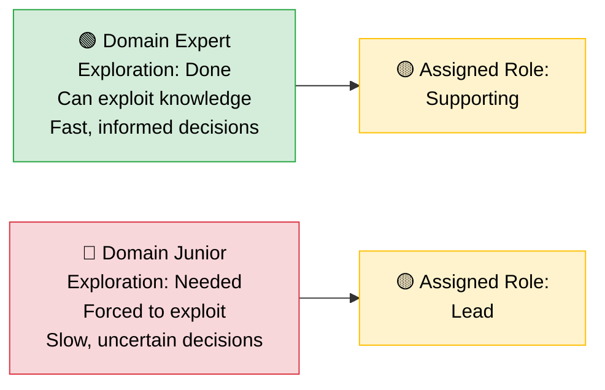

  

A new project kicks off — migrating a critical system to a platform nobody on the team has used before. Well, almost nobody. There's one person who's built on it. Shipped production workloads. Knows the failure modes.

They don't get the lead. The person with the most years of experience does. The senior. The one with the title.

Everyone defers. The titled lead chairs the meetings, makes the architecture calls, approves the designs. The person who actually knows the platform sits three rows back on the call, unmuted only when asked a direct question.

Six weeks later, the project is behind. Decisions are being revisited. The team is frustrated but can't quite name why.

You've seen this movie. Maybe you've been in it. Maybe you've been on both sides.

<!-- truncate -->

## The Default: Title = Lead

Here's the unspoken assumption: if someone is senior, they must be competent at *everything*. Years of experience becomes a universal proxy for expertise. Ten years in the industry? You can lead anything.

Except you can't. And deep down, everyone knows it.

Patrick Lencioni's *The Five Dysfunctions of a Team* describes the foundation that high-performing teams are built on: **vulnerability-based trust** — the ability to admit what you don't know without it being used against you. When a senior person is handed the lead on a project in an unfamiliar domain, the incentive structure works against that honesty. Admitting "I don't know this space" feels like admitting you don't deserve your title. So you don't say it. You wing it. You rely on general experience and hope it translates.

And the rest of the team? They see the title. They see the years. They don't push back. Lencioni calls this the second dysfunction: **fear of conflict** — not shouting matches, but the healthy, necessary act of challenging ideas regardless of who proposed them. When the most senior person in the room makes a call in a domain they don't understand, the team's silence isn't agreement. It's avoidance.

:::note
Lencioni's model is about team dynamics, not org design. But the dysfunction he describes — the inability to be vulnerable about gaps — is exactly what plays out when seniority is used as a proxy for domain expertise. The team can't function if the lead can't say "I'm learning here."
:::

The dysfunction isn't that the senior person is incompetent. It's that the system made it impossible for anyone to say the obvious: *you're junior here*.

## The Map Is Not the Territory

There's a deeper problem with the "seniority equals universal competence" assumption. Expertise doesn't transfer the way we pretend it does.

Donella Meadows, in *Thinking in Systems*, describes how every system has its own structure — its own feedback loops, delays, and leverage points. Understanding one system deeply doesn't mean you understand another. A senior backend engineer who's spent a decade optimising distributed databases has a rich mental model — of *that* system. Put them in charge of a frontend migration and they're operating on a map of a different territory. They'll look for the patterns they know. They'll optimise for the wrong feedback loops. They'll apply leverage in places that don't move the needle.

Meadows was writing about complex adaptive systems — economies, ecosystems, organisations. Software domains aren't quite that complex. But the principle holds: **the mental model that makes you effective in one system can actively mislead you in another.** The senior person isn't just starting from zero — they're starting from a confident misapplication of the wrong model.

This isn't a failure of intelligence. It's a failure of fit.

## The Explore-Exploit Mismatch

Brian Christian and Tom Griffiths, in *Algorithms to Live By*, describe the **explore-exploit tradeoff** — one of the most fundamental problems in decision theory. When you're new to a domain, the optimal strategy is to *explore*: gather information, try approaches, build a mental model. When you're experienced, you *exploit*: leverage what you know to make fast, high-quality decisions.

The problem with putting a domain-junior person in the lead role is that it compresses the exploration phase. The role demands decisiveness — architecture calls, priority decisions, technical direction — before the person has had time to build the mental model that makes those decisions good. They're forced into exploit mode with nothing to exploit.

Meanwhile, the domain-experienced person — who *could* be exploiting their deep knowledge to move fast — is stuck in a supporting role, watching decisions get made slowly and often incorrectly.

To be fair, Christian and Griffiths frame explore-exploit as an individual's optimal strategy under uncertainty, not as an organisational staffing argument. But the mapping is useful: **when you assign leadership to someone who hasn't explored the domain, you're asking them to run an algorithm with no data.**

The algorithm is running backwards.

## Authority Without Influence, Influence Without Authority

Robert Cialdini's *Influence* identifies six principles that drive human decision-making. One of them is **authority** — we follow people who hold positions of power. It's deeply wired. When someone with a senior title speaks, people listen. Not because of what they said, but because of who said it.

Cialdini would point out that authority *is* a form of influence — and a powerful one. The problem isn't that authority doesn't work. It's that it works *too well* in the wrong context. When the authority figure lacks domain expertise, the team still follows — because the authority signal overrides their own judgment. The decisions feel legitimate because of who made them, not because of what was decided.

Here's what happens in practice: the titled lead makes a decision. The domain expert quietly disagrees but doesn't escalate — partly because of the authority dynamic, partly because of the trust and conflict dysfunctions Lencioni describes. The team follows the decision. When it goes wrong, the expert gets pulled in to fix it. They do the work without the credit or the autonomy.

Cialdini also describes **social proof** — we look to others to determine what's correct. In a team where everyone defers to the titled lead, social proof reinforces the hierarchy even when it's wrong. Nobody wants to be the first to say "I think the person with fewer years actually knows better here."

The result: decisions are made by the wrong person, validated by the wrong signals, and corrected too late.

## Let the Topology Match the Reality

So what's the alternative?

Matthew Skelton and Manuel Pais, in *Team Topologies*, describe how team structures should be designed around **cognitive load** — every person has a finite capacity for the complexity they can handle. When you force someone to lead in a domain they're unfamiliar with, you're maxing out their cognitive load on just understanding the basics. They have nothing left for actual leadership: setting direction, making tradeoffs, unblocking the team.

Meanwhile, the person who knows the domain is underloaded in their role but overloaded with frustration.

Skelton and Pais also introduce the idea of **enabling teams** — teams whose job isn't to build the thing, but to help others build it better. This is where seniority actually shines. A senior engineer who's junior in a specific domain can still add enormous value — not as the technical lead, but as an enabler. They can remove organisational blockers. They can coach on communication and stakeholder management. They can spot cross-domain patterns the specialist might miss. They can create the conditions for the domain expert to lead effectively.

That's not a demotion. That's a better use of everyone's strengths.

:::tip
Skelton and Pais write about team-level design, not individual role assignments. But the principle scales down: match the cognitive load of the role to the person whose mental model fits the domain.
:::

## The Steelman: Why Seniority-Based Leadership Exists

Before you forward this to your skip-level with a "SEE?!" — let me steelman the other side. Because the counterarguments are real, and ignoring them would make this post dishonest.

**Leadership is a transferable skill.** Seniors aren't just picked for domain knowledge. They're picked for risk management, stakeholder navigation, decision-making under ambiguity, and the political capital to absorb blame when things go wrong. A domain expert with two years of experience may know the platform cold but freeze when the VP asks why the timeline slipped. These skills take years to develop and they *do* transfer across domains.

**Pattern recognition across domains is real.** A senior who's shipped ten projects has seen failure modes that repeat regardless of the technology: scope creep, integration risk, team dynamics collapse, the "it works on my machine" phase. That meta-experience has value even when the specific domain is new.

**Accountability requires organisational weight.** When a project fails, someone needs to face the music. Juniors — no matter how domain-expert they are — often lack the political resilience and organisational standing to bear that weight. Putting them in the lead can expose them to consequences they're not equipped to handle.

**The ramp-up is asymmetric.** A senior can learn a new domain faster than a junior can learn leadership. The knowledge gap is often smaller than the leadership gap.

**Regulated industries have real constraints.** In finance, healthcare, and defence, the person signing off on decisions may need specific certifications, clearances, or years of documented experience. "But they know the platform" doesn't satisfy an auditor.

These are legitimate reasons. The argument isn't that seniority never matters. It's that seniority *alone* is an insufficient signal for domain-specific leadership — and that organisations default to it reflexively rather than deliberately.

| Factor | Seniority Provides | Domain Expertise Provides |
|---|---|---|
| **Technical decisions** | Pattern recognition, risk instinct | Correct answers, fast iteration |
| **Stakeholder management** | Credibility, political capital | Technical credibility in the domain |
| **Team dynamics** | Conflict resolution, mentoring | Trust from the team (they know you know) |
| **Accountability** | Organisational weight to absorb failure | Ability to prevent failure in the first place |
| **Speed** | Knows how orgs work | Knows how the technology works |

The best outcome isn't picking one column. It's combining both — deliberately.

## What This Looks Like in Practice

If you buy the argument — including the caveats — here's what changes:

**Normalise the phrase "I'm junior in this."** Especially from senior people. When a staff engineer says "I've never worked with this technology, so I'm going to lean on the team for technical direction" — that's not weakness. That's the vulnerability-based trust Lencioni says high-performing teams are built on. It gives everyone else permission to be honest too.

**Decouple technical leadership from the org chart.** The person who drives technical decisions should be the person best positioned to make good ones in that domain. Sometimes that's the most senior person. Often it's not. Create a culture where technical leadership is fluid — it follows the work, not the hierarchy.

**Use seniority for what it's actually good at.** Senior people have pattern recognition across domains. They know how to navigate organisational politics. They've seen projects fail and can spot the warning signs early. They're excellent at mentoring, at asking the right questions, at knowing when to escalate. None of that requires them to be the domain expert. All of it is valuable.

**Let the domain expert lead the domain.** Give them the authority to match the influence they already have. Back them publicly. Shield them from the organisational noise so they can focus on the technical decisions that matter. And pair them with a senior who handles the stuff they're *not* equipped for yet — stakeholders, politics, air cover.

**Size matters.** This argument holds strongest for focused technical projects — platform migrations, new technology adoption, specific system redesigns. For large programmes spanning multiple domains, you probably *do* need a senior with broad experience coordinating across workstreams. The key is knowing which situation you're in.

## The Rewrite

Let's go back to that opening scene. New project. New platform. The organisation needs a lead.

This time, the engineering manager looks at the team and says: "Priya has built on this platform before. She's going to drive the technical direction. I'll handle stakeholder communication and make sure she has what she needs."

Priya is two levels below the manager on the org chart. Nobody cares. She knows the platform. She makes fast, informed decisions. The team trusts her because her expertise is visible, not assumed. The manager adds value by clearing the path — not by pretending to know the terrain.

The project ships on time. More importantly, the team wants to work together again.

## The Point

Everybody is junior in something. The CTO is junior in the framework that launched last year. The principal engineer is junior in the compliance domain they've never touched. The engineering manager is junior in the platform their team just adopted.

This isn't a flaw. It's just reality.

The flaw is pretending otherwise. The flaw is a system that uses years of experience as a universal ranking and then acts surprised when the wrong people are making the wrong calls.

The best teams don't ignore seniority. They don't abolish hierarchy. They just refuse to confuse title with expertise. They let people lead where they're strong and learn where they're not. They treat "I'm junior here" as the starting point of trust, not the end of credibility.

> **Everybody is junior in something. The best teams are the ones brave enough to admit it.**

---

*This post draws on ideas from Patrick Lencioni's "The Five Dysfunctions of a Team," Donella Meadows' "Thinking in Systems," Brian Christian & Tom Griffiths' "Algorithms to Live By," Robert Cialdini's "Influence," and Matthew Skelton & Manuel Pais' "Team Topologies." Where concepts are applied beyond the authors' original scope, I've tried to note the stretch.*
