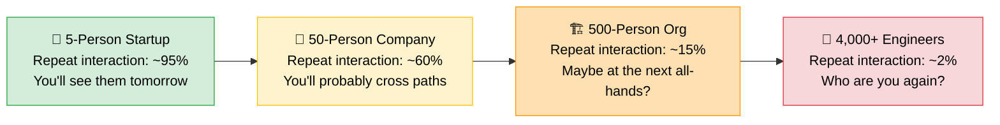
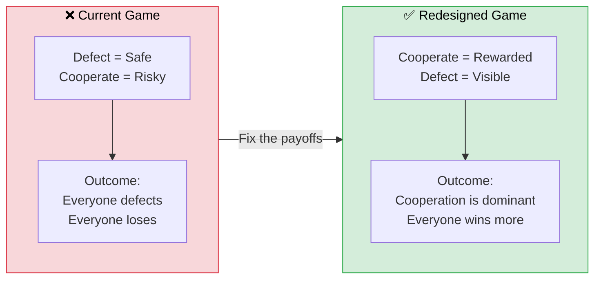

  

You send a Slack message to another team. It's a reasonable request — a small API change, maybe a code review, maybe just a question about how their service handles edge cases. You write it clearly. You tag the right person. You even add a polite emoji. And then... nothing. No reply. No acknowledgment. Just the quiet hum of a message marked as read and promptly ignored.

You're not being ghosted because they're bad people. You're being ghosted because the game they're playing *rewards* ignoring you.

This isn't a people problem. It's a math problem.

<!-- truncate -->

  

## The Game You're Actually Playing

Every cross-team interaction in a large engineering org is a move in a game. Not a metaphorical game — an actual, mathematically modelled one. Game theorists call it the **Prisoner's Dilemma**, and it's been explaining why rational people make collectively terrible decisions since 1950.

Here's how it works in your org. Two teams face a choice: **cooperate** (help the other team) or **defect** (ignore the request and focus on your own sprint).

| | **Team B Cooperates** | **Team B Defects** |
|---|---|---|
| **Team A Cooperates** | ✅ Both ship faster. Shared trust. System health improves. | 😤 Team A loses sprint velocity. Team B ships on time. |
| **Team A Defects** | 😏 Team A ships on time. Team B is blocked. | 💀 Both move slowly. Tech debt grows. Zero trust. |

Look at this from Team A's perspective. If Team B cooperates, Team A is *better off defecting* — they get the benefit of Team B's help without spending any time themselves. If Team B defects, Team A is *still better off defecting* — why waste time helping someone who won't help you back?

Defection is the **dominant strategy**. No matter what the other team does, ignoring them is the rational move.

And here's the gut punch: Team B is running the exact same calculation. So both teams defect. Both teams move slower. Both teams accumulate tech debt. And everyone wonders why "collaboration" is just a word on a slide deck.

  

## Why Smart People Choose to Lose

The math alone would be bad enough. But your brain makes it worse. Three cognitive biases turn a bad incentive structure into an unbreakable one:

**Zero-sum thinking.** "If their team gets credit for this feature, that's credit my team *doesn't* get." Promotions feel scarce. Executive attention feels finite. So helping another team feels like handing them your bonus. It's not true — collaboration creates value that didn't exist before — but the lizard brain doesn't do nuance.

**Loss aversion.** Losing four hours to a cross-team code review *hurts* twice as much as the abstract "gain" of organisational health. The loss is concrete and immediate. The gain is diffuse and delayed. Your brain treats them very differently, and the loss wins every time.

**Hyperbolic discounting.** Closing a Jira ticket *today* feels more valuable than contributing to a shared library that saves everyone time *next quarter*. The sprint is real. The future is theoretical. So you optimise for the sprint, and the future never arrives.

These aren't character flaws. They're features of human cognition that evolved for survival in small groups. They just happen to be catastrophically mismatched with how modern engineering orgs work.

  

## The Shadow of the Future (Or Lack Thereof)

Here's the thing that makes cooperation *possible* in small teams: you know you'll need that person tomorrow. Game theorists call this **the shadow of the future** — the knowledge that today's actions have consequences in future interactions. In a five-person startup, the shadow is long. You help me today, I help you tomorrow. Defection is risky because reputation is immediate and inescapable.

But at 4,000 engineers? The shadow shrinks to nothing.

Cooperation through direct reciprocity only works when the chance of meeting again outweighs the cost-to-benefit ratio of helping. At 4,000 engineers spread across dozens of teams, that probability approaches zero for cross-team interactions. And when reputation doesn't travel across silos — when nobody knows or remembers that you helped another team last quarter — there's no indirect reciprocity either.

The result? Defection isn't just rational. It's the *only stable equilibrium*.

> **The game is broken. Not the people.**

## Change the Game, Not the Players

So here's the thing. You can keep sending motivational Slack posts about "one team, one dream." You can run another workshop on collaboration. You can put "teamwork" in the company values and print it on a mug.

Or you can change the math.

The Prisoner's Dilemma only traps you when the payoff matrix rewards defection. **Change the payoffs, and cooperation becomes the dominant strategy instead.** This isn't idealism — it's mechanism design. You're not asking people to be better. You're making "better" the rational choice.

Three moves. That's all it takes to flip the matrix.

## Three Moves That Flip the Matrix

  

### Move 1: Make Reputation Travel

The shadow of the future is short because reputation doesn't cross team boundaries. Fix that.

Implement **collaborative credit** — a visible, tracked record of cross-team contributions. Code reviews for other teams, shared library maintenance, helping unblock a dependency. Make it show up in quarterly reviews. Make it part of how you evaluate engineering managers, not just their team's sprint velocity.

When helping another team *visibly counts*, the payoff for cooperation goes up and the temptation to defect goes down. Suddenly, "I helped three other teams ship this quarter" is a career-building statement, not a confession of distraction.

### Move 2: Shared OKRs That Make Cooperation Pay

If 100% of your team's key results are local, you've mathematically guaranteed that helping another team is a cost with no reward. The payoff matrix is rigged.

Make at least **30% of every team's OKRs dependent on another team's success** or on a global outcome. When Team A's performance is partially tied to Team B shipping on time, the calculus flips. Mutual cooperation becomes more valuable than the temptation to defect, because defection now *hurts your own score*.

This isn't about forcing collaboration. It's about making the incentive structure honest about what the organisation actually needs.

### Move 3: Reduce the Cost of Cooperation

Even when people *want* to cooperate, the transaction cost can be prohibitive. Finding the right person, explaining context, negotiating backlog priority, following up — it's exhausting. When cooperation is expensive, defection wins by default.

The fix: **make cooperation cheap.**

- **InnerSource** — Let any team submit a PR to any codebase. The requester provides the solution instead of waiting in someone else's backlog. (We wrote about this — satirically, but the point stands.)
- **Internal developer portals** — Self-service API discovery, documentation, and cloud resources. Kill the search cost.
- **Platform teams** — Shared infrastructure that nobody has to negotiate for. (The Price of Anarchy post covers why this matters at scale.)

When the cost of cooperation drops, the threshold for reciprocity becomes achievable again — even at 4,000 engineers.

## "Sounds Great in Theory"

If you're reading the three moves above and thinking *"this is idealistic"* — you're not wrong. Nobody flips a payoff matrix overnight. You probably can't rewrite your org's OKR framework by Friday.

But here's the thing: you don't need to change the whole system. You just need to make cooperation *slightly* more rewarding than defection in your immediate sphere. Small changes compound.

| Role | Action | Why It Works |
|---|---|---|
| **Engineer** | Publicly thank cross-team help in Slack or retros | Reputation travels when you carry it |
| **Engineer** | Review a PR from another team, even when nobody asked | 20 minutes buys enormous goodwill |
| **Engineer** | Document your team's services properly | Reduces the cost of cooperation for everyone after you |
| **Engineer** | When someone helps you, help them back *visibly* | Manually creates the reciprocity loop the org structure broke |
| **Tech Lead / EM** | Add "cross-team contributions" to performance conversations | Suddenly it counts |
| **Tech Lead / EM** | Treat blocking another team with the same urgency as your own sprint | It's not a favour — it's the system working |
| **Tech Lead / EM** | Celebrate cross-team wins in standups and retros | Makes the invisible visible |
| **Tech Lead / EM** | Pair someone with the requesting team instead of context-switching alone | Cheaper, and builds relationships |
| **Director+** | Make cross-team contribution a promotion criterion | Not a nice-to-have — a signal of what the org actually values |
| **Director+** | Stop rewarding teams purely on local velocity | It's the single biggest incentive to defect |
| **Director+** | Run quarterly dependency reviews | If Team A blocks Team B every sprint, that's a system problem |

None of these require a reorg. None of them need executive sponsorship. They just need one person to start, and for that person's team to notice it works.

> **You don't have to fix the game. You just have to make the first cooperative move.**

## The One Takeaway

You've sat through the game theory. You've seen the payoff matrix. You've read about cognitive biases and the shadow of the future. Here's the one thing I want you to remember:

> **You don't have a collaboration problem. You have a payoff problem. Fix the game.**

Stop blaming engineers for being "siloed." They're not siloed — they're *rational*. They're responding to a system that punishes cooperation and rewards local optimization. If you want different behaviour, build a different game.

Make reputation travel. Tie outcomes together. Make cooperation cheap. Do those three things, and you won't need to convince anyone to collaborate. The math will do it for you.

---

*This is the second in a series on game theory and engineering at scale. Read the Price of Anarchy post for the system-level view, and Why You Should Never Do InnerSource for one concrete mechanism that makes cooperation cheap. The research behind this post draws on Robert Axelrod's work on the evolution of cooperation and the Prisoner's Dilemma literature.*
