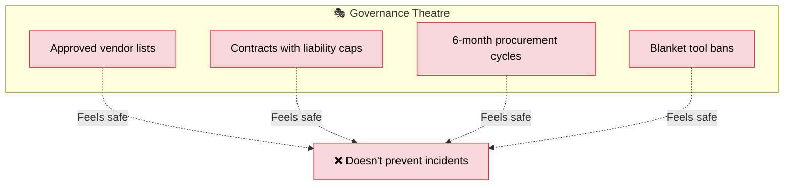
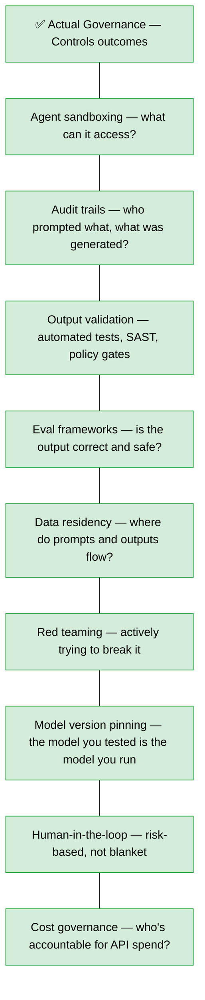

Somewhere in your organisation right now, an engineer wants to use a tool. It's open source. It's battle-tested. Half the Fortune 500 runs it in production. But first, they need to fill out a vendor assessment form, get InfoSec sign-off, wait for procurement to confirm there's a contract in place, and then — maybe, in four to six months — they'll get a "yes" or a "no" from someone who's never written a line of code.

Meanwhile, the startup down the road shipped the feature last Tuesday.

But hey, at least you've got a contract. You can *sue* them if things go wrong. Right?

<!-- truncate -->

## The Contract Will Protect Us

Let's start with the big one — the security blanket that justifies half of enterprise governance: *"We need a contract so we have legal recourse."*

Let's test that theory with the largest IT outage in history.

**July 19, 2024.** CrowdStrike pushes a faulty update. [8.5 million Windows machines crash globally](https://en.wikipedia.org/wiki/2024_CrowdStrike-related_IT_outages). Every Fortune 500 airline goes down. 75% of top healthcare organisations affected. [Estimated damages to Fortune 500 companies alone: **$5.4 billion**](https://fortune.com/2024/08/03/crowdstrike-outage-fortune-500-companies-5-4-billion-damages-uninsured-losses/).

I know because I was there. Friday night, flight cancelled, standing in a terminal watching departure boards go dark one by one — with a conference talk to give Saturday morning. The approved vendor's approved update took down the approved airline's approved systems. Nobody asked me if I'd approved that.

CrowdStrike was the *approved vendor*. Every one of those enterprises had a contract. They'd been through procurement. They'd passed InfoSec review. They had SLAs, liability clauses, the works.

So how much have those enterprises recovered?

**Zero dollars.** As of today — not a cent.

Delta Air Lines — 7,000 cancelled flights, 1.3 million stranded passengers, [$500M+ in claimed losses](https://www.theregister.com/2025/05/21/judge_allows_deltas_lawsuit_against/) — is still in court. CrowdStrike is ["confident" their liability is capped at **single-digit millions**](https://www.crn.com/news/security/2025/5-things-to-watch-in-delta-s-lawsuit-against-crowdstrike) thanks to the limitation of liability clause in the contract. The same contract that was supposed to protect Delta.

The shareholder lawsuit? [Dismissed](https://www.theregister.com/2026/01/14/crowdstrike_shareholders_lawsuit_dismiss/). The passenger class action? [Dismissed](https://www.expertinstitute.com/resources/insights/crowdstrike-customer-class-action-2024-outage/). CrowdStrike's stock? [Fully recovered within five months](https://finbold.com/if-you-invested-1000-in-crowdstrike-stock-after-the-global-it-outage-heres-your-return-now/). Customer retention rate? [97%](https://thisweekhealth.com/news_story/crowdstrike-maintains-97-customer-loyalty-despite-major-it-outage/).

The contract didn't protect anyone. It protected *CrowdStrike*.

:::warning
CrowdStrike's "apology" to affected partners? [$10 Uber Eats gift cards](https://dataconomy.com/2024/07/25/crowdstrike-gift-card-apology-uber-eats/). For a $5.4 billion outage. That's not compensation — that's a meme.
:::

## "But Cloud Vendors Have SLAs"

Sure they do. Let's read the fine print.

[AWS's Customer Agreement, Section 9.1](https://aws.amazon.com/agreement/):

> *"NEITHER AWS NOR YOU... WILL HAVE LIABILITY TO THE OTHER... FOR (A) INDIRECT, INCIDENTAL, SPECIAL, CONSEQUENTIAL OR EXEMPLARY DAMAGES, (B) THE VALUE OF YOUR CONTENT, (C) LOSS OF PROFITS, REVENUES, CUSTOMERS, OPPORTUNITIES, OR GOODWILL, OR (D) UNAVAILABILITY OF THE SERVICES"*

Read that again. They explicitly exclude liability for *the service being unavailable*. The thing you're paying them for. If it breaks, they're not liable for the fact that it broke.

What you *do* get: service credits. Not cash — credits against future usage of the service that just failed you. Typically [10-30% of your monthly bill](https://aws.amazon.com/compute/sla/) for the affected service.

So if you spend $100K/month on AWS and suffer a 4-hour outage that costs the business $2M in lost revenue, the SLA credit might be $10K. That's 0.5% of the actual loss. [One analysis found SLA credits covered roughly **8% of actual losses**](https://www.softwareseni.com/calculating-the-true-cost-of-cloud-outages-and-downtime).

> **The contract doesn't transfer risk. It transfers paperwork.**

## The Approved Vendor List: A History of Spectacular Failures

The approved vendor list exists to ensure you only use "safe," vetted software. Let's look at how that's worked out.

**SolarWinds (2020)** — On the approved vendor list of [18,000 organisations](https://www.breachsense.com/blog/solarwinds-data-breach-case-study/) including the US Treasury, Department of Homeland Security, and most of the Fortune 500. Russian intelligence inserted malicious code into *trusted software updates* — the exact mechanism enterprises rely on. Even [FireEye, a cybersecurity company, was compromised](https://www.reflectiz.com/blog/solarwinds-supply-chain-attack/) through their own approved vendor.

**CrowdStrike (2024)** — The approved *security* vendor. $5.4 billion in damages. Already covered.

**Log4Shell (2021)** — [93% of enterprise cloud environments](https://pmc.ncbi.nlm.nih.gov/articles/PMC10472545/) were vulnerable. CVSS severity: 10.0 (maximum). The US Department of Homeland Security estimated [finding and fixing every instance would take a decade](https://www.ibm.com/blog/how-to-detect-patch-log4j-vulnerability/). Total lawsuits against Apache, the maintainer? Zero. Because the Apache Software Foundation runs on [$3 million a year](https://sanesecurityguy.com/articles/log4shell-giants-standing-on-the-shoulders-of-dwarves/) — roughly $8,600 per project. And Log4j wasn't on your approved vendor list directly — it was *inside* the commercial software that was.

| Incident | Approved Vendor? | Damages | Recovered |
|---|---|---|---|
| **SolarWinds** | ✅ On 18,000 approved lists | Billions (classified + commercial) | Negligible |
| **CrowdStrike** | ✅ Approved security vendor | $5.4B+ (Fortune 500 alone) | $0 |
| **Log4Shell** | ✅ Inside approved software | Tens of billions | $0 |

The approved vendor list didn't prevent any of these. It *enabled* them — by creating a trusted channel for the damage to flow through.

## "Do I Still Need Approval to Build a Slack App?"

Let's zoom in on something that'll make your eye twitch.

An engineer wants to build an internal Slack bot. It reads messages in one channel and posts a summary in another. It touches no customer data. It has no external network access. It runs on the company's own infrastructure.

The approval process:
1. Vendor assessment form (even though there's no vendor — you're building it)
2. InfoSec review (4-6 weeks)
3. Architecture review board (next available slot: 3 weeks)
4. Data classification exercise (it's Slack messages between engineers, but sure)
5. Procurement sign-off (for a tool that costs $0)
6. Privacy impact assessment (it's an internal bot, but policy says...)

Total elapsed time: 2-4 months. For a Slack bot. That an engineer could build in an afternoon.

Now multiply that by every internal tool, every automation, every experiment. Every time someone has an idea that could save the team hours a week, they run the same gauntlet. Most of them don't bother. They either build it quietly and don't tell anyone (hello, shadow IT), or they just... stop having ideas.

[Vendor onboarding at large companies takes up to 6 months](https://visotrust.com/resources/vendor-onboarding/). [52% of companies say third-party assessments take 31-60 days](https://visotrust.com/resources/vendor-onboarding/). And the average enterprise wastes [$18 million annually on unused software licenses](https://technologymatch-demo.webflow.io/blog/a-practical-guide-for-vendor-management-lifecycle) — software that *was* approved but nobody uses because by the time it arrived, the team had moved on.

> **The process doesn't prevent risk. It prevents progress.**

## Code Isn't the IP Anymore

Here's the existential one. For decades, the governance narrative has been: *"The code is the competitive advantage. Leaking it is catastrophic."*

But what happens when AI writes most of it?

- [41% of all code](https://www.aimagicx.com/blog/developer-productivity-paradox-ai) is now AI-generated (Stack Overflow 2025 Survey, 49,000+ respondents)
- GitHub Copilot contributes [46% of code](https://www.aboutchromebooks.com/github-copilot-statistics/) for its active users — 20 million of them
- Microsoft: [up to 30% of the company's code](https://techcrunch.com/2025/04/29/microsoft-ceo-says-up-to-30-of-the-companys-code-was-written-by-ai/) is AI-generated. Their CTO expects 95% by 2030
- Google: [over 30% of new code](https://officechai.com/ai/well-over-30-of-code-at-google-is-now-written-by-ai-ceo-sundar-pichai/) is AI-generated

If anyone with the same agent and the same prompt can regenerate functionally equivalent code, the code itself is a commodity. The actual IP is the **problem definition, the architecture decisions, the domain knowledge, the data, and the evaluation criteria** that guide the agents. Not the for-loops.

Open source already proved this. Linux, Kubernetes, React — all public. The companies using them still have competitive advantages. The code was never the moat. The *system* was.

And yet, governance frameworks still treat source code like it's the crown jewels. They lock down repos, restrict tooling, and add friction to every commit — protecting an asset whose value is rapidly approaching zero while ignoring the assets (data, brand, system design) that actually matter. Even domain knowledge — once the ultimate moat — is being disrupted as AI context windows grow large enough to absorb and reason over entire codebases.

## What Regulation Actually Says (vs. What People Think It Says)

**What people think:** "Regulators require us to use approved, contracted enterprise vendors."

**What regulators actually say:**

| Regulator | Actual Position | Mandates Specific Vendors? |
|---|---|---|
| **EU AI Act** | [Risk-based classification](https://www.enterprise.gov.ie/en/what-we-do/innovation-research-development/artificial-intelligence/eu-ai-act/), proportionate obligations | No — prescribes outcomes: transparency, fairness, logging |
| **FINRA** | ["Technology neutral"](https://www.finra.org/rules-guidance/notices/24-09) — existing rules apply | No — explicitly says don't "rely on vendors as a shield" |
| **SEC** | [Materiality-informed disclosure](https://www.corporatecomplianceinsights.com/sec-2026-examination-priorities-financial-services/) | No — cares about accurate representation and governance |
| **US Treasury** | [230 control objectives](https://home.treasury.gov/news/press-releases/sb0395) across 6 domains | No — asks "what evidence demonstrates effectiveness?" |
| **FCA (UK)** | ["Adaptive and positive approach"](https://www.postonline.co.uk/technology/7960052/fca-insists-it-will-regulate-ai-via-existing-frameworks) via existing frameworks | No — no new AI-specific rules |
| **MAS (Singapore)** | [Principles-based, pro-innovation](https://fintechnews.sg/127900/ai/mas-ai-toolkit/) | No — risk-based human oversight, outcomes-focused |

Every single major regulator takes a technology-neutral, outcomes-based approach. They care about **controls, audit trails, and accountability** — not which vendor's logo is on the invoice.

FINRA said it explicitly: firms must *"update their written supervisory procedures to address the use of AI rather than relying on vendors as a shield."* The regulator is literally telling you that the contract isn't the governance.

## The Real Governance Stack

So if contracts, approved vendor lists, and code lockdowns aren't the answer — what is?

The question isn't *"is this tool on the approved list?"* It's *"do we have the infrastructure to use any tool safely?"*

If the answer is no, banning tools is a band-aid. If the answer is yes, the vendor's size doesn't matter — the controls do.

## The Startup Ecosystem Is Already Enterprise-Grade

The reflexive response: *"We can't use startup tools. They might disappear. They're not enterprise-ready."*

The data says otherwise:

- **LangChain** — [$125M Series B at $1.25B valuation](https://blog.langchain.com/series-b/). 110,000+ GitHub stars. [47,000+ production installations](https://www.reale.one/insights/ai-agent-frameworks-enterprise-adoption-2026).
- **Promptfoo** — Used by [over 25% of Fortune 500](https://thenextweb.com/news/openai-acquires-promptfoo-ai-security-frontier). [Acquired by OpenAI](https://winbuzzer.com/2026/03/10/openai-acquires-promptfoo-to-secure-its-ai-agents-xcxwbn/) in March 2026.
- **Langfuse** — [6M+ monthly SDK installs](https://aws.amazon.com/blogs/apn/transform-large-language-model-observability-with-langfuse/). [Acquired by ClickHouse](https://clickhouse.com/blog/clickhouse-acquires-langfuse-open-source-llm-observability) (valued at $15B) in January 2026.
- [**62% of Fortune 500**](https://www.reale.one/insights/ai-agent-frameworks-enterprise-adoption-2026) companies now use at least one AI agent framework in production.

These aren't scrappy side projects. They're the tools that the world's largest companies are already running in production — while the procurement team is still evaluating the vendor assessment form.

The hybrid model makes sense: **big vendors for infrastructure and data** (AWS, GCP, Azure — compliance, residency, stability), **startup/OSS ecosystem for tooling and orchestration** (speed of innovation, composability, low switching cost). The risk profiles are categorically different. Treating them the same is a category error.

## The Cost of Not Moving

Here's what doesn't show up on a risk register:

- [**95% of enterprise AI pilots fail**](https://ainews.com/p/mit-report-95-of-generative-ai-pilots-are-failing-in-business) to deliver measurable P&L impact (MIT, July 2025). Not because the tech doesn't work — because governance and organisational friction kill them before they scale.
- [**Two-thirds of companies**](https://www.ainvest.com/news/companies-stuck-ai-pilot-phase-missed-ebit-impact-creates-rerating-risk-2603/) are stuck in pilot phase (McKinsey). The ones that aren't are pulling ahead fast.
- Top AI performers are [**2x as likely to quit**](https://stacker.com/stories/technology/great-ai-attrition-why-your-best-ai-talent-eyeing-exit) their jobs (Upwork Research Institute). The best engineers leave because they can't use modern tools. We're left with people comfortable with the status quo.
- Gartner predicts [**75% of large enterprises**](https://www.credo.ai/gartner-market-guide-for-ai-governance-platforms) will adopt dedicated AI governance platforms by 2026. Not "ban AI tools" — *govern* them.

The risk of adopting is visible. The risk of *not* adopting is invisible. Nobody gets fired for maintaining the status quo. People get fired for approving a tool that causes an incident. The incentive structure rewards inaction — the same payoff problem that makes cross-team collaboration break down at scale.

> **You avoided the risk of a new tool causing an incident. Instead, you got the risk of irrelevance. One is recoverable. The other isn't.**

## The One Thing

We don't ban cars because they can crash. We build seatbelts, airbags, speed limits, licensing, and insurance. Enterprises that ban AI tools are banning cars. Enterprises that build governance frameworks are building roads.

The approved vendor list didn't stop SolarWinds. The contract didn't stop CrowdStrike. The SLA won't make us whole when the cloud goes down. And the procurement process won't protect us from the startup that ships in a week what takes us a quarter.

Stop asking *"is this tool safe enough to use?"* Start asking *"do we have the governance infrastructure to use any tool safely?"*

Build the seatbelts. Then drive.

---

*References: [CrowdStrike outage analysis](https://fortune.com/2024/08/03/crowdstrike-outage-fortune-500-companies-5-4-billion-damages-uninsured-losses/), [AWS Customer Agreement](https://aws.amazon.com/agreement/), [EU AI Act](https://www.enterprise.gov.ie/en/what-we-do/innovation-research-development/artificial-intelligence/eu-ai-act/), [FINRA Regulatory Notice 24-09](https://www.finra.org/rules-guidance/notices/24-09), [US Treasury FS AI RMF](https://home.treasury.gov/news/press-releases/sb0395), [MAS Project MindForge](https://fintechnews.sg/127900/ai/mas-ai-toolkit/), [MIT GenAI Divide Report](https://ainews.com/p/mit-report-95-of-generative-ai-pilots-are-failing-in-business), [Gartner Market Guide for AI Governance Platforms](https://www.credo.ai/gartner-market-guide-for-ai-governance-platforms). The SolarWinds, Log4Shell, and CrowdStrike case studies draw from multiple sources linked throughout.*
