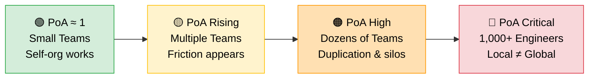
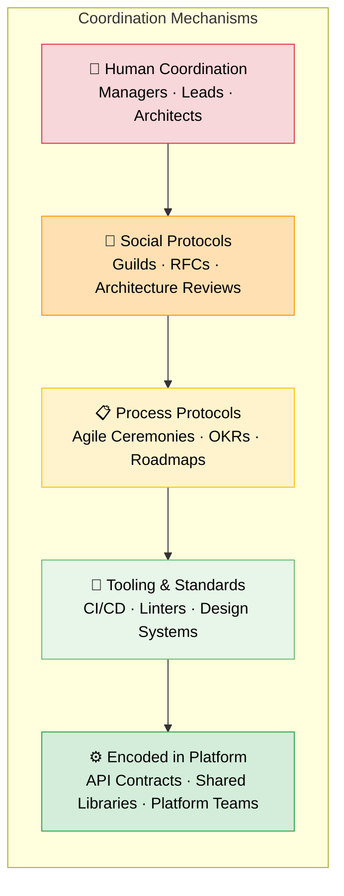

  

You've seen it. Every team is shipping. Every sprint has velocity. Dashboards are green. And yet somehow, the organisation feels *slower* than it should. Everyone's busy, but nothing moves faster.

Here's a clue from an unexpected place.

Picture a motorway at rush hour. Every driver is making the smartest choice *for themselves* — fastest lane, shortest route, optimal speed. Nobody's doing anything wrong. And yet the whole system grinds to a halt. More cars, more rational decisions, more gridlock.

This isn't a failure of individual intelligence. It's a failure of coordination. Game theorists have a name for it — the **Price of Anarchy** — and it might be the most useful mental model for understanding what management actually is, when it matters, and when it doesn't.

<!-- truncate -->

  

## The Price of Anarchy, Explained Simply

The Price of Anarchy (PoA) measures how much worse a system performs when everyone acts in their own self-interest compared to when someone coordinates the whole thing.

  Price of Anarchy&nbsp;&nbsp;=
  
    Optimal coordinated outcome
    Worst outcome under selfish behaviour
  

If PoA = 1, selfish behavior already produces the optimal outcome—coordination adds no benefit.

If PoA = 2, the system performs twice worse under selfish behavior than under optimal coordination.

Each driver picks the fastest route for *themselves*. But collectively, everyone floods the same roads and creates congestion. A coordinated system — traffic lights, lane management, congestion charges — produces better flow for *everyone*.

Now replace "drivers" with "engineers" and "roads" with "priorities."

:::info
In orgs, "selfish" usually means local optimisation — team, department, KPI.
:::

## Where Does It Break? The PoA Spectrum

Not every organisation needs the same level of coordination. The Price of Anarchy scales with complexity:

The question isn't whether coordination is needed. It's *how much*.

## When PoA ≈ 1: The Self-Organising Dream

Five engineers in a startup. Everyone knows what everyone else is doing. Architecture decisions converge through hallway conversations. Priorities are obvious because there's one product, one customer, one goal.

Here, PoA is close to 1. Self-organisation works. A manager in this context is overhead — someone scheduling meetings about things people already know.

> *"Resilience arises from a rich structure of many feedback loops that can work in different ways to restore a system even after a large perturbation."*
> — Donella Meadows, *Thinking in Systems*

Small teams *are* rich feedback loops. Information flows freely. The system self-heals. This is the dream that flat-org advocates sell — and for small, tightly-coupled teams, it's real.

  

## When PoA Grows: The 1,000-Person Reality

Now scale that to 1,000 engineers across dozens of teams, multiple brands, different time zones, and competing roadmaps.

Here's what happens without coordination: the payments team rewrites the checkout service for speed while the mobile team is building a feature that depends on the old API. A platform team builds a shared logging library that nobody discovers because it lives in a repo no one knows about. Three teams independently build authentication modules — each one perfectly designed for its use case, none of them compatible.

Each decision is rational *in isolation*. But collectively? Everyone's busy, everyone's productive by their own metrics, and the organisation moves slower than the sum of its parts.

> *"If the architecture of the system and the architecture of the organisation are at odds, the architecture of the organisation wins."*
> — Matthew Skelton & Manuel Pais, *Team Topologies*

This is where the Price of Anarchy climbs. Not because people are selfish or incompetent — but because local optimisation and global optimisation are fundamentally different problems.

## What Managers Actually Do (When They're Doing It Right)

What if managers exist primarily to **reduce the Price of Anarchy**?

Not to control. Not to approve. Not to sit in meetings about meetings. To *coordinate a system that can't coordinate itself at scale*.

**Alignment** — Defining shared goals so that local decisions naturally converge toward global outcomes. When Team A and Team B both understand the same north star, their independent choices are more likely to be compatible.

**Coordination** — Resolving cross-team conflicts, sequencing dependencies, and making trade-offs that no single team has the context to make. This is the traffic light function — not telling people where to go, but preventing collisions.

**Global optimisation** — Prioritising what matters for the whole system, not just one part of it. Sometimes the right call for the organisation is the wrong call for an individual team. Someone has to make that visible.

But good managers also do things that aren't coordination — they develop people, create psychological safety, and have hard conversations. That's not PoA reduction. That's *capacity building* — making the individual nodes in the system better, not just better connected.

  

The best managers do both.

## Agile as a Coordination Protocol

Agile doesn't eliminate the need for coordination. It *encodes* it into lightweight protocols:

- **Shared backlog** → alignment on priorities
- **Sprint planning** → coordination of effort
- **Retrospectives** → feedback loops for system correction
- **Product ownership** → a single point of global optimisation for a domain

Within a single team, Agile ceremonies can keep PoA close to 1. Across ten teams? Twenty? You need something more. This is why organisations layer coordination mechanisms: architecture guilds, platform teams, tech radar, RFCs, shared standards. Each one is a protocol designed to reduce PoA without adding hierarchy.

## Coordination as Code

Some of the most effective PoA reducers aren't people at all — they're systems:

The further down this stack you push coordination, the less you need humans in the loop for routine alignment. **API contracts** prevent incompatible interfaces. **Design systems** prevent reinvented UI patterns. **Platform teams** prevent everyone solving infrastructure differently.

These reduce the Price of Anarchy the same way traffic lights do — not by telling people what to do, but by making the right thing the easy thing.

The more you encode into tooling and platforms, the more you free managers to focus on the hard problems — the ones that require judgment, context, and relationships.

## The Real Question

The real question is: **how much coordination is needed to keep the Price of Anarchy acceptable?**

| System | Primary coordination mechanism |
|---|---|
| Open source projects | Maintainers + contribution guidelines |
| Small agile teams | Ceremonies + product owner |
| Scaled agile orgs | Tribes, guilds, platform teams |
| Large enterprises | Systems + governance + tooling (built by managers) |

Different systems need different PoA controls. A five-person startup doesn't need the same coordination overhead as a 1,000-person engineering org. But a 1,000-person org pretending it can self-organise like a startup? That's traffic without traffic lights.

## The Takeaway

The goal is building systems that coordinate themselves, so that management can focus on the things only humans can do: building trust, developing people, and making the hard calls when the protocols aren't enough.

> *"Not finance. Not strategy. Not technology. It is teamwork that remains the ultimate competitive advantage, both because it is so powerful and so rare."*
> — Patrick Lencioni, *The Five Dysfunctions of a Team*

Next time you're stuck in traffic, remember: the problem isn't the drivers. It's the system. And that's exactly what management is for.

---

*The Price of Anarchy was formalised by Elias Koutsoupias and Christos Papadimitriou in 1999. Go deeper: [Thinking in Systems](https://www.chelseagreen.com/product/thinking-in-systems/) by Donella Meadows, [Team Topologies](https://teamtopologies.com/) by Skelton & Pais, and [The Five Dysfunctions of a Team](https://www.tablegroup.com/product/dysfunctions/) by Patrick Lencioni.*
