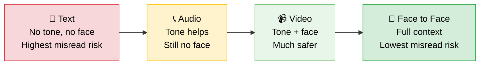

  
  

    
The Communication Iceberg

    
What people see vs. what drives everything

  

  

    
💬 What We Say

    
"I'm fine." "No worries." "Sure."

  

  

    
🎭 How We Say It

    
The tone. The pause. The reply that took 6 hours.

  

  

    
🔒 What We Actually Mean

    
The real message, encoded in safe language.

  

  

    
❤️‍🩹 What We Need But Can't Say

    
To be seen. Valued. Chosen. Safe. Loved.

  

  "Most conversations happen above the waterline. Most meaning lives below it."

*"Between what is said and not meant, and what is meant and not said, most of love is lost."* — Khalil Gibran

It never starts big.

It starts with a Tuesday evening. You come home tired. Your partner asks, "How was your day?" You say, **"Fine."** What you meant was: *"Exhausting. I felt invisible in that meeting. I could use a hug."* But "fine" was easier. Quicker. Safer.

Or it starts in a standup. Your lead asks, "Any blockers?" You say, **"Nope, all good."** What you meant was: *"I've been stuck on this for two days and I don't want to look incompetent."* But "all good" was safer. Faster. Less exposed.

One "fine" costs nothing. One "all good" costs nothing. But 365 of them? That's a year of someone living next to you and not knowing you. Or a year of your team thinking everything's on track when it isn't.

This is the **daily drift** — the tiny, almost invisible gap between what we say and what we mean, repeated so often it becomes the distance between two people who once understood each other without words.

A caveat before we go further: not every "fine" is a suppression. Sometimes it genuinely means fine. Sometimes it means "I don't have the energy to unpack this right now" — and that's a healthy boundary, not a failure. The drift happens when brevity becomes the *default*, when filtering stops being a choice and starts being the only mode.

<!-- truncate -->

---

> *"What we don't say is as important as what we do say. In fact, it may be more important."* — Virginia Satir, *The New Peoplemaking*

---

## How the Drift Works

Think of it like **compound interest — but in reverse.**

A single miscommunication is a rounding error. But communication debt compounds daily.

  

- **Day 1:** "I'm fine." *(Small gap. Barely noticeable.)*
- **Day 30:** "We don't really talk anymore." *(The gap has a shape now.)*
- **Day 180:** "I don't think you understand me." *(The gap has walls.)*
- **Day 365:** "I don't know when we stopped connecting." *(The gap is the relationship.)*

No one wakes up one morning in a broken relationship or a dysfunctional team. They **drift** there — one unspoken truth at a time.

---

## The Five Daily Drifts

These are the small, everyday patterns that create distance. You'll recognize them.

  

### Drift 1: The Shorthand Assumption

*"They should know what I mean by now."*

The longer we know someone, the less we explain. We assume shared history equals shared understanding. It doesn't. People change. Context changes. What "I need space" meant two years ago isn't what it means today.

> *"The single biggest problem in communication is the illusion that it has taken place."* — George Bernard Shaw

### Drift 2: The Protective Edit

*Typing the real message... then deleting it and sending the safe one.*

We self-censor dozens of times a day. Not lies — just edits. Softening, minimizing, rounding the sharp edges off our truth. Each edit is small. But over time, the people closest to us are interacting with a curated version of us — and wondering why the connection feels thin.

### Drift 3: The Unasked Question

*Sensing something is off... and choosing not to ask.*

We notice. The short reply. The change in energy. The smile that doesn't reach the eyes. But asking means opening a door we might not be ready to walk through. So we let it pass. And the other person registers: *they didn't ask. Maybe they don't care.*

The cruelest part? Both people are protecting themselves. And both people feel alone.

### Drift 4: The Performative Response

*"That's great!" (It's not.) "I'm happy for you!" (I'm conflicted.) "No, I totally understand." (I don't.)*

Social scripts keep things smooth. But they also keep things shallow. When every response is performed rather than felt, conversations become transactions — and people start feeling lonely in the presence of others.

> *"Loneliness does not come from having no people around you, but from being unable to communicate the things that seem important to you."* — Carl Jung

### Drift 5: The Delayed Truth

*"I'll bring it up later." (You won't.)*

The right moment rarely comes. But delay isn't always avoidance — sometimes timing genuinely matters, and raising a hard truth when someone is mid-crisis or exhausted isn't courage, it's poor judgment. The drift happens when "later" *always* means never. When the truth stays unspoken not because the timing is wrong, but because saying it feels too risky.

> *"Unexpressed emotions will never die. They are buried alive and will come forth later in uglier ways."* — Sigmund Freud

---

## The Flash Fight: When Miscommunication Explodes

The daily drift is slow. But there's another kind — the **flash fight**. A single sentence, misread in real-time, that detonates a conversation in under 60 seconds.

These aren't about years of accumulated silence. These are about **two people hearing completely different things from the same words** — and reacting to what they heard, not what was said.

  

### How a Flash Fight Works

1. **The Trigger** — Someone says something with one meaning.
2. **The Misread** — The other person hears it through their own filter — stress, insecurity, past wounds, assumptions.
3. **The Reaction** — They respond to what they *heard*, not what was *said*.
4. **The Escalation** — The first person, confused by the reaction, gets defensive. Now both are fighting ghosts.

> *"We don't see things as they are, we see them as we are."* — Anaïs Nin

### The Flash Fight Across Relationships

**Between Partners:**
> **Said:** "Did you already eat?"
> **Meant:** "I was hoping we'd eat together."
> **Heard:** "You should have waited for me." (criticism)
> **Fight:** "Why do you always make me feel guilty about everything?"

A simple question filtered through a history of feeling judged. The fight isn't about dinner. It never was.

**Between Friends:**
> **Said:** "Oh, you're hanging out with them again?"
> **Meant:** "I miss spending time with you."
> **Heard:** "I'm judging your other friendships." (possessiveness)
> **Fight:** "You don't own my time."

The real need — *I miss you* — got encoded as observation, decoded as accusation.

**Between Parent and Child:**
> **Said:** "That's what you're wearing?"
> **Meant:** "I want you to make a good impression because I care."
> **Heard:** "You look bad. I don't approve of you." (rejection)
> **Fight:** "You never accept me for who I am."

A lifetime of these and the child stops sharing anything at all.

### Why Flash Fights Happen

They're not about the words. They're about the **filter** the words pass through. Stress compresses patience — neutral sentences land as attacks. History rewrites the present — if you've been criticized before, you hear criticism even when it's not there. And in text messages especially, there's no tone, no face, no context — the reader's mood *becomes* the tone.

The medium matters more than we think. For anything with emotional weight, the richer the channel, the less room for misread:

We all know the meeting that should've been an email. But the reverse is more dangerous: the text that should've been a conversation. "Could have been a mail" wastes time. "Should have been face-to-face" wastes trust.

Worth noting: this pattern shows up most in anxious or insecure attachment dynamics. Two securely attached people hearing "Did you already eat?" probably won't spiral. The flash fight isn't universal — but if you've been in one, you know exactly what it feels like.

> *"Every criticism, judgment, diagnosis, and expression of anger is the tragic expression of an unmet need."* — Marshall Rosenberg, *Nonviolent Communication*

### Defusing the Flash Fight

**Say what you heard, not what you concluded.** *"When you said that, what I heard was [X] — is that what you meant?"* This one sentence has prevented more fights than any apology ever has.

**Name your filter.** *"I think I'm hearing this through my stress right now. Can you say that again?"* This is disarming — it tells the other person your reaction might not match their intention.

**Get off text for anything with emotional weight.** Text strips tone, face, and context. What's left is raw words filtered through whatever mood the reader is in.

**Repair fast.** If a flash fight does happen — and it will — the speed of repair matters more than the perfection of the apology. *"I think we just had two different conversations. Can we rewind?"*

---

## The Drift at Work

The same patterns play out in business — just in conference rooms instead of kitchens. And the stakes are different: at home, the drift costs intimacy. At work, it costs decisions, trust, and eventually people.

| **The Surface** | **The Subtext** | **The Drift** |
|---|---|---|
| "Let's take this offline." | "I disagree but not in front of everyone." | Decisions made without real debate |
| "That's a bold approach." | "I think this will fail." | Failure without honest pre-mortem |
| "Sure, I can take that on." | "I'm already drowning but can't say no." | Burnout disguised as teamwork |
| "Sounds good to me." | "I don't have the energy to fight this." | Consensus that isn't consensus |
| "I'm fine with either direction." | "I have a strong opinion but it's not safe to share it." | The best idea never enters the room |

If this looks familiar, it should. The [Prisoner's Dilemma at work](/blog/game-theory-engineering-collaboration) is partly a communication problem — teams defect because saying "I need help" or "I disagree" feels riskier than staying silent. And when [everybody is junior in something](/blog/everybody-is-junior-in-something) but nobody says it, the team follows the wrong map in silence.

A note on power dynamics: the advice to "say what you really mean" is unevenly distributed. A senior leader saying "I disagree" is candor. A junior employee saying the same thing can be career risk. The drift at work isn't just about individual courage — it's about whether the environment makes honesty safe. If your team's drift is growing, the first question isn't "why won't people speak up?" It's "what happens when they do?"

---

## Said vs. Meant — The Translation Table

A cheat sheet for the subtext you already know but pretend you don't.

  

---

## The Practical Playbook: Closing the Gap

Not theory — tools you can use **today**.

  

### 1. The "What I'm Really Saying Is..." Reset

Mid-conversation, when you catch yourself circling or softening, use this phrase as a hard reset:

***"Actually — what I'm really trying to say is..."***

- **With a partner:** "What I'm really saying is I felt hurt when you didn't ask about my interview."
- **With a boss:** "What I'm really saying is I don't think this timeline is realistic."
- **With a friend:** "What I'm really saying is I've missed you and I don't know how to say it without sounding dramatic."

**Why it works:** It gives you permission to be direct without it feeling like a confrontation. The phrase itself signals honesty, and people lean in when they hear it.

### 2. Name the Dynamic, Not the Person

When something feels off, resist the urge to say "you're being distant" or "you never listen." Instead, name what's happening *between* you:

- **"I notice we're both being really careful right now."**
- **"It feels like there's something in the room we're not saying."**
- **"I think we're having two different conversations — can we reset?"**

**Why it works:** It makes the pattern the problem, not the person. People can look at a dynamic together. They can't look at an accusation together.

### 3. The Curiosity Over Conclusion Rule

When someone says something that lands wrong, choose curiosity before conclusion.

Instead of: *"That was dismissive."*
Try: **"When you said that, here's what I heard — is that what you meant?"**

Instead of: *"You obviously don't care."*
Try: **"I want to understand what you meant by that, because the story I'm telling myself is..."**

That last phrase — **"the story I'm telling myself"** — is disarming because it owns the interpretation rather than projecting it.

**Why it works:** Most conflict isn't about what was said. It's about what was *heard*. This practice closes the gap between the two.

### 4. The Evening Check-In (2 Minutes, Not 2 Hours)

For personal relationships. One question, asked daily:

**"Is there anything unsaid between us right now?"**

Most days the answer is "no." But the days it's "actually, yes..." — those are the days you prevent a drift from becoming a distance. This won't work for everyone — some people find structured check-ins performative, and that's fine. The point isn't the format. It's creating *any* regular space where honesty is the default.

**Why it works:** The gap can't compound if you zero it out every 24 hours.

### 5. The Repair Bid

[Gottman's research](https://www.gottman.com/blog/the-magic-relationship-ratio-according-science/) — based on decades of studying thousands of couples — found that successful relationships aren't conflict-free. They're **repair-rich**. The ratio that predicts relationship stability isn't zero conflict. It's 5 positive interactions for every 1 negative one, and the speed at which couples repair after rupture.

  

    

      ➕
      ➕
      ➕
      ➕
      ➕
      :
      ➖
    

    
The 5:1 Ratio

    
Five positive interactions for every one negative. Below this, relationships predict toward failure.

  

A "repair bid" is any attempt to reconnect after a gap:

- **"I think I said that badly. Can I try again?"**
- **"I've been thinking about what you said, and I think I missed your point."**
- **"I was short with you earlier. That wasn't about you."**

**Why it works:** You can't prevent every drift. But you can repair before it compounds. The bid itself — the willingness to come back and try again — *is* the message.

> *"It's not about never having conflict. It's about the speed of the repair."* — John Gottman, *The Seven Principles for Making Marriage Work*

---

## The Knowing-Doing Gap

I know all of this. I've read the research, written the playbook, and I still catch myself saying "I'm fine" when I'm not. Knowing the drift exists doesn't stop it. Awareness isn't practice.

So if there's one thing — just one — that actually closes the gap on a daily basis, it's this:

  
🔑

  

    Catch the edit before you send it.
  

That moment when you type the real thing, then delete it and send the safe version — that's the drift happening in real time. You can feel it. The backspace. The softening. The "actually, never mind."

You don't have to be radically honest about everything. You just have to send the first version *once more* than you did yesterday. One unedited sentence. One "actually, what I really mean is..." That's the practice. Not a personality overhaul — just one fewer backspace.

---

## A Final Thought

> *"Between stimulus and response there is a space. In that space is our freedom to choose."* — Viktor Frankl, *Man's Search for Meaning*

The distance between two people is rarely created by a single moment. It's built in the small, daily choices — to say the safe thing or the true thing, to ask or to let it pass, to repair or to let it harden.

The drift compounds. But so does connection. One honest sentence a day, one real question, one moment of "here's what I actually mean" — and the math reverses.

You don't have to say everything. You just have to say *more* than you did yesterday.

---

*The gap between what is said and what is meant is where love goes quiet. But it's also where it can come back — one true word at a time.*
