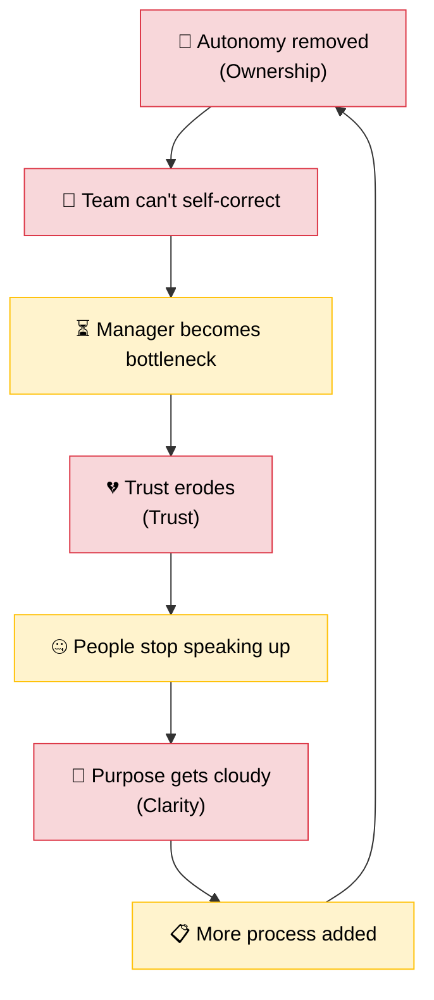

  

An inversion manual for engineering leaders

I'm a new parent. I have no idea how to be a good father. I've read zero parenting books. I have no framework, no methodology, no "5 pillars of effective fatherhood."

But I know what a bad father looks like. I know what breaks trust. I know what makes a child stop talking to you. I know what happens when you're physically present but emotionally absent.

I don't have a playbook for getting it right. I have a very clear list of things to never do.

Turns out, that's enough. And it applies to more than parenting.

<!-- truncate -->

---

## Invert, Always Invert

Charlie Munger — Warren Buffett's partner for over six decades — borrowed a line from the 19th-century mathematician Carl Jacobi: *"Man muss immer umkehren"* — **invert, always invert.**

Munger's version was characteristically blunt:

  
🔄

  

    "All I want to know is where I'm going to die, so I'll never go there."
  

  
— Charlie Munger

In investing, this means: don't just pick great stocks — avoid the catastrophic ones. The math is asymmetric. A 50% loss requires a 100% gain to recover. Avoiding ruin matters more than chasing brilliance.

> *"It is remarkable how much long-term advantage people like us have gotten by trying to be consistently not stupid, instead of trying to be very intelligent."* — Charlie Munger

  

Small bad decisions compound. So do small good ones. The gap between the two curves isn't talent or intelligence — it's the habit of asking "what would fail here?" before you act.

Every leadership book is about what to do. This post is about how to think about what to stop doing.

**A caveat:** inversion won't make you visionary. It won't teach you to hire brilliantly or set a direction that inspires people. But it will stop the undermining of people who can do those things. And in practice, the distance between a terrible manager and a good one is shorter than most people think — and it starts with learning to see what's already going wrong.

**The question is:** how do you find that list? Not *my* list — yours. For your team, your context, your failure modes.

Gary Klein's **premortem** technique is inversion made practical. Before a project starts, you ask the team: *"Imagine it's six months from now and this project has failed spectacularly. Tell me why."* People who'd never raise a risk in a planning meeting will happily explain why something *already* failed — because it's hypothetical, it's safe, and it's fun. The premortem is inversion with a calendar invite.

Three lenses help.

---

## The Three Lenses

There's no universal checklist for bad management. Every team is different. Every context has its own failure modes. But almost every management failure I've seen — as an engineer growing under bad managers, as a lead making my own mistakes, and now watching the pattern repeat — falls into one of three categories.

Every team runs on three fundamental resources: **clarity of purpose** (do we know what matters?), **ownership and autonomy** (can we act on it?), and **trust** (can we be honest about how it's going?). Degrade any one and the team degrades.

Think of these as lenses. Put on any one of them and look at a decision you're about to make. If the decision looks dangerous through *any* of the three, it probably is.

  

---

## Lens 1: Ownership & Autonomy

*"Am I enabling agency or creating dependency?"*

Donella Meadows, in *Thinking in Systems*, makes a claim that changed how I think about everything:

> *"Missing information flows is one of the most common causes of system malfunction. Adding or restoring information can be a powerful intervention, usually much easier and cheaper than rebuilding physical infrastructure."*

A team is a system. It has inputs (context, priorities, constraints), processes (how decisions get made, how work flows), and outputs (shipped software, solved problems, happy users). Between all of these are **feedback loops** — the signals that tell the system whether it's working or not.

A good manager strengthens feedback loops. A bad manager — often without realising it — severs them.

**Here's what severing looks like in practice.**

A manager sits in a leadership meeting. They hear about a strategic shift — a product line is being deprioritised, a reorg is coming, a key dependency is being sunset. They absorb it. They go back to the team and share... nothing. Or a sanitised version. Or the parts they think the team "needs to know."

That's an information flow, cut. The team is now making decisions based on an incomplete picture of reality. They're optimising for a world that no longer exists. When their decisions turn out to be wrong — and they will — they'll come to the manager for correction. The manager provides it. And a pattern forms: the team learns that only *one person* can see the full board. Every decision routes through them. The manager becomes the bottleneck — not because they wanted to, but because they removed the information that would have let the team decide on their own.

Not all context can be shared — confidential reorgs, HR matters, sensitive commercial decisions have real boundaries. The failure isn't sharing selectively when there's a genuine reason. The failure is when filtering becomes the *default* — when the instinct is to hold back rather than pass through, and the team operates on a fraction of the picture not because of confidentiality, but because of habit.

In psychology, this is called **[learned helplessness](https://en.wikipedia.org/wiki/Learned_helplessness)** — when people repeatedly experience that their actions don't affect outcomes, they stop trying. The team isn't passive because they're lazy. They're passive because they've been trained to be. Every overridden decision, every withheld context, every "let me handle this" taught them that their agency doesn't matter.

**The inversion question: Before any decision, ask — "Am I enabling agency or creating dependency?"**

- Keeping context to yourself? Removes a feedback loop.
- Requiring your approval on every PR? Removes the team's ability to self-correct.
- Skipping retros because "we're too busy"? Removes the system's ability to learn.
- Sharing the *why* behind a decision, not just the *what*? Adds a feedback loop.
- Letting the team see the same dashboards you see? Adds a feedback loop.
- Making your calendar and priorities visible? Adds a feedback loop.

Andy Grove, in *High Output Management*, defined a manager's output as: **the output of their team + the output of adjacent teams they influence.** Not your own output. The moment you start optimising for your own involvement — being in every meeting, touching every decision, being the person who "knows everything" — you're optimising for a metric that actively degrades the system.

  
🏖️ The Holiday Test

  

    If your team can't function when you're on holiday, you're not leading — you're <strong>load-bearing</strong>. You haven't built a system. You've made yourself a single point of failure wearing a lanyard.
  

The systems lens doesn't give you a list of things to do. It gives you a diagnostic: **follow the information.**

They don't get it because you didn't give it to them.

If you've read [Why Everyone's Busy But Nothing Ships Faster](/blog/why-everyones-busy-but-nothing-ships-faster), you'll recognise this pattern at the org level — the Price of Anarchy, where rational local decisions produce irrational global outcomes. The same dynamic plays out inside a single team when the manager becomes the coordination bottleneck. Everyone's busy. Nothing moves.

---

## Lens 2: Trust

*"Am I making honesty cheaper or more expensive?"*

The ownership lens asks whether people *can* act. The trust lens asks whether they *will* — whether they feel safe enough to be honest, take risks, and disagree.

Patrick Lencioni's *The Five Dysfunctions of a Team* builds a pyramid. At the base: **trust**. Not "I trust you to deliver on time" trust — **vulnerability-based trust**. The kind where you can say "I don't know," "I was wrong," or "I need help" without it being used against you. Amy Edmondson's research calls this **psychological safety** — and Google's [Project Aristotle](https://rework.withgoogle.com/guides/understanding-team-effectiveness/) found it was the single strongest predictor of team effectiveness. Not talent. Not process. Not tooling. Whether people felt safe enough to be honest.

Every layer above depends on it:

  
🏆 Results

  
📋 Accountability

  
🤝 Commitment

  
⚡ Healthy Conflict

  
🔒 Trust

  
Lencioni's Five Dysfunctions — inverted, it all starts with trust

Now invert it. If trust is the foundation, what cracks it?

**The fastest way to destroy trust is to make honesty expensive.**

It happens every time someone is punished for bringing bad news. Every time a manager takes credit for the team's work in a leadership meeting. Every time a difficult conversation is avoided because being liked feels safer than being honest. Every time someone raises a concern and it's dismissed — or worse, remembered during their next performance review.

Lencioni calls the result **artificial harmony** — a surface-level peace that masks unresolved issues. It feels like a healthy team. It's actually a team where nobody feels safe enough to disagree. And the issues don't disappear. They compound. Every week you delay a difficult conversation, the conversation gets harder and the damage gets deeper. The same compound effect that erodes relationships through [small daily silences](/blog/the-daily-drift) erodes teams through avoided truths.

Same with kids, by the way. The conversation you're avoiding with your teenager? It's not getting easier with time either.

**The inversion question: Before any decision, ask — "Am I making honesty cheaper or more expensive?"**

- Taking credit for the team's work? Makes honesty expensive — why would anyone go above and beyond if the credit flows up?
- Deflecting blame downward? Makes honesty expensive — why would anyone admit a mistake if it'll be used against them?
- Naming people specifically when things go well? Makes honesty cheaper — people feel seen.
- Going first in a post-mortem with "here's what *I* got wrong"? Makes honesty cheaper — you've modelled vulnerability.
- Addressing the underperformer directly and early? Makes honesty cheaper — the team sees that problems get addressed, not ignored.
- Caring enough about someone's growth to tell them the truth, even when it's uncomfortable? Makes honesty cheaper. If you care but won't say it, you're not being kind — you're being cowardly. And the team knows it.

The trust lens isn't about being nice or being tough. It's about asking: **after this interaction, will people be more or less likely to tell me the truth?**

If the answer is "less" — you've just made your system dumber. Because a team that can't tell you the truth can't tell you when things are breaking. And by the time you find out on your own, it's a P1.

---

## Lens 3: Clarity of Purpose

*"Am I adding noise or signal?"*

In software engineering, **cognitive load** refers to the total mental effort being used in a developer's working memory. John Sweller's cognitive load theory breaks it into three types:

| Type | What it is | Management example |
|---|---|---|
| **Intrinsic** | The inherent difficulty of the problem | The actual engineering challenge — this is the work |
| **Extraneous** | Mental effort spent on things that don't help | Confusing processes, unclear priorities, unnecessary approvals |
| **Germane** | Productive effort building mental models | Learning the domain, understanding the architecture |

A manager's job, through this lens, is simple: **maximise intrinsic and germane load. Minimise extraneous load.** Let people spend their brainpower on the actual problem and on getting better at solving it — not on navigating your process, decoding your priorities, or figuring out which of the five "urgent" things is actually urgent.

Matthew Skelton and Manuel Pais, in *Team Topologies*, took this further: cognitive load isn't just an individual constraint — it's a **team** constraint. If a team is responsible for too many domains, too many services, too many contexts, their collective cognitive capacity is overwhelmed. They don't need more people. They need less scope.

The same applies to management overhead. Every process you add, every approval gate, every status meeting, every "quick sync" — it's extraneous load. It's weight on the team's working memory that doesn't help them solve the problem. If you've read [Your Agents Are Running. So Why Are You Still Exhausted?](/blog/cognitive-load-agentic-ai), you'll recognise this — even with AI doing the heavy lifting, the *coordination* load can still crush you.

**Here's the failure mode that nobody talks about: the manager who creates urgency.**

Everything is P1. Every request is "ASAP." Every Slack message is a fire. The team is perpetually in reactive mode, sprinting from one emergency to the next. Deep work disappears. Strategic thinking disappears. What's left is a group of talented people playing whack-a-mole with their calendars.

Michael Porter said it plainly: *"The essence of strategy is choosing what not to do."* A manager who treats everything as urgent has made no strategic choices. They've abdicated the hardest part of the job — saying no — and passed the cognitive burden to the team.

Eisenhower's framing remains the clearest:

> *"What is important is seldom urgent and what is urgent is seldom important."*

Parents do this too, by the way. Every extracurricular becomes essential. Every homework assignment is a crisis. The kid's calendar looks like a sprint board with no capacity planning. And then we wonder why they're anxious. The load lens works everywhere.

**The inversion question: Before any decision, ask — "Am I adding noise or signal?"**

- Adding an approval step? Noise.
- Writing a clear decision doc so the team doesn't have to guess your reasoning? Signal.
- Calling a meeting that could've been a message? Noise.
- Saying no to a stakeholder request so the team can focus? Signal.
- Changing priorities mid-sprint without explanation? Noise.
- Maintaining a visible, stable list of the team's top 3 priorities? Signal.
- Requiring the team to context-switch between four projects? Noise.
- Shielding the team from organisational noise so they can go deep? Signal.

If you can't articulate your team's top 3 priorities right now — without checking a document — you don't have priorities. You have a to-do list. And your team is paying the cognitive tax for your lack of clarity.

---

## The Cascade: One System, Three Lenses

These three lenses aren't independent. They're one system. Remove autonomy (ownership) → the team can't self-correct → decisions bottleneck through one person → trust erodes because people feel controlled → they stop speaking up → purpose gets cloudy because the real problems stay hidden (clarity) → more process gets added to compensate → which removes more autonomy.

Donella Meadows would recognise this immediately — it's a **reinforcing feedback loop**. The same kind of coordination failure that makes [everyone busy but nothing ship faster](/blog/why-everyones-busy-but-nothing-ships-faster).

The good news? **Reinforcing loops work in both directions.** Give the team ownership → they make better decisions → the bottleneck dissolves → trust builds because people feel empowered → they speak up earlier → purpose sharpens because real problems surface → less process needed → which frees up more autonomy.

It doesn't require fixing everything. Find one link in the chain and break it. The loop does the rest.

---

## The Inversion Checklist

This isn't exhaustive. It can't be — every team has its own failure modes. But if you understood the three lenses above, you could generate a hundred of these. Here are some to get you started.

  The Inversion Checklist
  
How to guarantee failure — and the inversions

**🔗 Ownership & Autonomy — Creating Dependency**

| ❌ To Fail, Do This | ✅ The Inversion |
|---|---|
| Make every decision flow through you | Apply the Holiday Test — if the team stops when you're gone, you've failed |
| Skip retros because "we're too busy" | The team that doesn't reflect doesn't learn |
| Optimise for preventing all mistakes | Optimise for recovery speed — [trust + guardrails > gatekeeping](/blog/governance-theatre) |
| Keep dashboards and metrics to yourself | Give the team the same visibility you have |

**💔 Trust — Making Honesty Expensive**

| ❌ To Fail, Do This | ✅ The Inversion |
|---|---|
| Punish people for bringing bad news | Thank them — they just saved you from finding out worse, later |
| Say "my door is always open" but react badly when people walk through it | Model vulnerability — go first with "here's what I got wrong" |
| Remember who disagreed with you | Remember who had the courage to disagree — that's your most valuable signal |
| Let the [titled lead run everything](/blog/everybody-is-junior-in-something) even when someone else knows the domain | Leadership follows expertise, not org charts |

**🧠 Clarity of Purpose — Adding Noise**

| ❌ To Fail, Do This | ✅ The Inversion |
|---|---|
| Call meetings that could be messages | Protect the team's deep work time like it's a production system |
| Change priorities mid-sprint without explanation | Stability of focus is a feature, not a bug |
| Add process to fix a people problem | Process scales. It doesn't heal. |
| Confuse your anxiety with their urgency | Your stress is not their priority |

The real list is the one you build yourself. Take the three questions — *Am I creating dependency? Am I making honesty expensive? Am I adding noise?* — and run them against every decision for a week. You'll find your own failure modes. They'll be more specific, more honest, and more useful than anything I could write here.

---

## The One Thing

I don't know how to be a great father. I might never figure it out. But my daughter won't remember whether I read the right book or followed the right framework. She'll remember whether I listened. Whether I showed up honestly. Whether I admitted when I got it wrong.

Your team is the same.

Nobody needs to be a great manager. Just not a bad one. And "not bad"? That's concrete. That's a lens to look through on a Tuesday afternoon when the week is going sideways.

  

    You don't need to be a great manager. You just need to stop being a bad one. The gap between those two is smaller than you think.
  

Three questions. That's the whole playbook.

*Am I enabling agency or creating dependency?*

*Am I making honesty cheaper or more expensive?*

*Am I adding noise or signal?*

If the answer leans toward the wrong half — that's the inversion. No framework needed. No book needed. Just stop doing that one thing.

What's left — after you remove everything that's killing the system — might just look like leadership.

**Remove what doesn't belong. What remains is the statue.**

---

*References: Charlie Munger's [inversion mental model](https://fs.blog/charlie-munger-inversion/). Carl Jacobi's "man muss immer umkehren." Gary Klein, [premortem technique](https://hbr.org/2007/09/performing-a-project-premortem). Donella Meadows, [Thinking in Systems](https://www.chelseagreen.com/product/thinking-in-systems/). Patrick Lencioni, [The Five Dysfunctions of a Team](https://www.tablegroup.com/the-five-dysfunctions-of-a-team/). Amy Edmondson, [psychological safety](https://en.wikipedia.org/wiki/Psychological_safety) and Google's [Project Aristotle](https://rework.withgoogle.com/guides/understanding-team-effectiveness/). Matthew Skelton & Manuel Pais, [Team Topologies](https://teamtopologies.com/). Andy Grove, [High Output Management](https://www.penguinrandomhouse.com/books/72467/high-output-management-by-andrew-s-grove/). John Sweller, [Cognitive Load Theory](https://en.wikipedia.org/wiki/Cognitive_load). [Learned helplessness](https://en.wikipedia.org/wiki/Learned_helplessness) (Seligman).*
