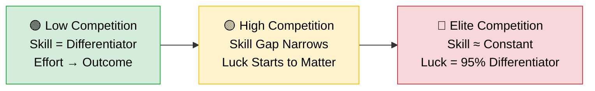
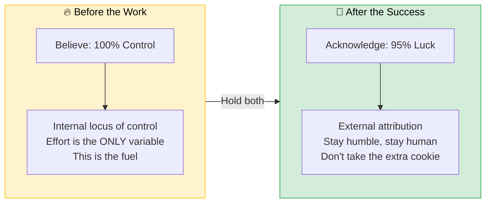

Look, you worked hard. You stayed late. You shipped that thing nobody else could ship. You earned every single promotion, every bit of recognition, every seat at the table. It was all you. 100%. No asterisks. No footnotes. Definitely no luck involved.

Right?

<!-- truncate -->

## You Definitely Do More Than Everyone Else

Here's a fun experiment. Get your team in a room and ask everyone to estimate their percentage contribution to the last project. Go on, I'll wait.

Done? Great. Add them up. If your team is anything like the ones in [Ross & Sicoly's research](https://www.semanticscholar.org/paper/Egocentric-Biases-in-Availability-and-Attribution-Ross-Sicoly/4c6f4665525501ea95db3a1c8bd96a8d032893b7), you just hit **140%**. Congratulations — your team apparently did more work than was physically possible. Someone call physics.

This is **Egocentric Bias**, and it's not because your team are liars. It's because you were there for 100% of your own late nights, your own difficult emails, your own "glue work" that held the project together. But you only saw about 20% of everyone else's. You remember your heroics in vivid detail. Theirs? Background noise.

The result? Every single person on the team walks away feeling slightly undervalued. And the person who got promoted? They're absolutely *certain* they deserved it. No luck required.

:::note
This is the same dynamic that makes cross-team collaboration feel thankless — you see your own effort, not theirs. If you've ever wondered why cross-team help feels invisible, this is why.
:::

## The Skill Saturation Problem

Let's talk about astronauts. NASA gets about 18,000 applications per intake. They pick roughly 12. Everyone who applies is already in the 99th percentile of human capability — PhDs, fighter pilots, engineers who've built things most of us can't even spell.

So what separates the 12 who get in from the 17,988 who don't?

When everyone maxes out the skill variable, it effectively becomes a constant. It cancels out. What's left is the messy, uncomfortable stuff — timing, visibility, which project you happened to be on, who happened to be in the room when your name came up.

[Robert Frank's research](https://blogs.lse.ac.uk/lsereviewofbooks/2016/06/28/book-review-success-and-luck-good-fortune-and-the-myth-of-meritocracy-by-robert-h-frank/) puts it bluntly: in high-competition fields, luck is the primary decider among equally talented peers. That tiny 5% of circumstance becomes the **95% differentiator** in who actually wins.

But sure, it was definitely the extra certification that got you the role. Definitely not the fact that the role only existed because someone quit unexpectedly (*Vacancy Chain Effect*). Definitely not the fact that you happened to be on the project that got executive visibility that quarter (*Mere Exposure Effect*).

## The Cookie Monster Effect

Here's where it gets properly uncomfortable. There's a study — the [Cookie Study](https://thenewstatistics.com/itns/2019/05/22/the-cookie-monster-study-the-highly-influential-memory-of-a-long-lost-study/) — where researchers randomly assigned people to "leader" and "subordinate" roles. Completely random. Coin flip. No merit involved whatsoever.

Within minutes, the "leaders" started taking more than their share of snacks, interrupting more, and showing less empathy. *Minutes.* Give someone a title — even a fake one — and watch the entitlement bloom in real time.

Now scale that up. You've been a senior engineer, a lead, a principal for years. You've had a tailwind of good managers, growing markets, and teams that made you look good. But from the inside, it all feels like engine. *Your* engine. Your grit. Your 4am deploys.

This is **Survivor Bias** meeting the **Tailwind Effect**:

| Bias | What It Feels Like | What's Actually Happening |
|---|---|---|
| **Egocentric Bias** | "I did most of the work" | You saw 100% of yours, 20% of theirs |
| **Survivor Bias** | "The system is fair — it worked for me" | You only see the winners, not the 17,988 |
| **Tailwind Effect** | "I got here through pure grit" | Favourable conditions feel invisible from inside |
| **Cookie Effect** | "I deserve this authority" | Even random power changes behaviour in minutes |

[Branko Milanovic's data](https://stonecenter.gc.cuny.edu/files/2006/01/branko_global_inequality_review_2006.pdf) is the real gut punch: **50% of your lifetime income** is determined by the country you were born in. Not your degree. Not your GitHub profile. The latitude and longitude of the hospital your mum happened to be in.

But yeah, it was definitely the side projects.

## The Paradox (Here's Where It Gets Useful)

So if luck matters this much, why bother? Why grind? Why stay up debugging that memory leak at 2am if the universe is just going to flip a coin anyway?

Because here's the paradox you have to hold in your head — two completely contradictory beliefs, simultaneously:

**Before the work:** Believe you are in 100% control. This isn't delusion — it's fuel. The only way to put in the 95% effort required to even *enter* the room where luck happens is to believe your effort is the whole story. No ticket, no lottery.

**After the success:** Acknowledge the 95% luck. Not to diminish what you did, but to stay human. To stay approachable. To avoid becoming the person who takes the extra cookie and doesn't even notice.

> **This isn't false modesty. It's the only mindset that scales.**

The leaders who hold both beliefs — fierce effort *and* radical humility — are the ones people actually want to follow.

## "But I Earned This"

Yeah, you did. And so did the 17,988 astronaut candidates who didn't get picked. And so did the engineer on the other team who built the same thing you built but didn't have a sponsor in the room. And so did the person who grew up in a country where "making it in tech" means something entirely different.

You earned your spot *and* you got lucky. Both things are true. Holding only one of them makes you either defeated or delusional. Holding both makes you dangerous — in the good way.

## So What Do You Actually Do With This?

If you lead people — and if you're reading this on an engineering docs site, you probably do or will — here's the move:

| Action | Why It Works |
|---|---|
| **Make the invisible visible** — Document glue work. Recognise mentoring, cross-team coordination, the person who unblocked three teams by writing a doc nobody asked for. | Egocentric bias means everyone's contributions are invisible to everyone else. Your job is to fix that. |
| **Increase the luck of others** — Sponsor someone into a room they wouldn't otherwise be in. Put someone's name forward for a project that'll give them visibility. | You had tailwinds. Build tailwinds for the people behind you. Be the lucky break for someone who's already put in the 95%. |
| **Stay humble, stay hungry** — Before the task: you control everything. After the task: you controlled very little. Rinse, repeat. | It's uncomfortable. It's also the only honest way to operate at scale. |

That last one — "increase the luck of others" — is the whole game. It's the same principle behind [InnerSource](/blog/why-you-should-never-innersource) (lowering barriers so talent finds opportunity) and behind fixing the payoff matrix (making cooperation the rational choice). The mechanism is different. The goal is the same: **build systems where the best people don't need to be lucky to succeed.**

> **Your goal as a leader isn't to be the smartest person in the room. It's to increase the luck of everyone else in it.**

---

*The research behind this post draws from Robert Frank's "Success and Luck," studies by Ross & Sicoly on egocentric bias, Keltner et al.'s cookie study on power and entitlement, and Branko Milanovic's work on global inequality. If you want the full rabbit hole, start with [Veritasium's analysis](https://www.youtube.com/watch?v=3LopI4YeC4I) and clear your afternoon.*
