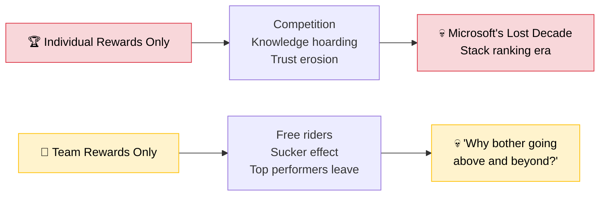
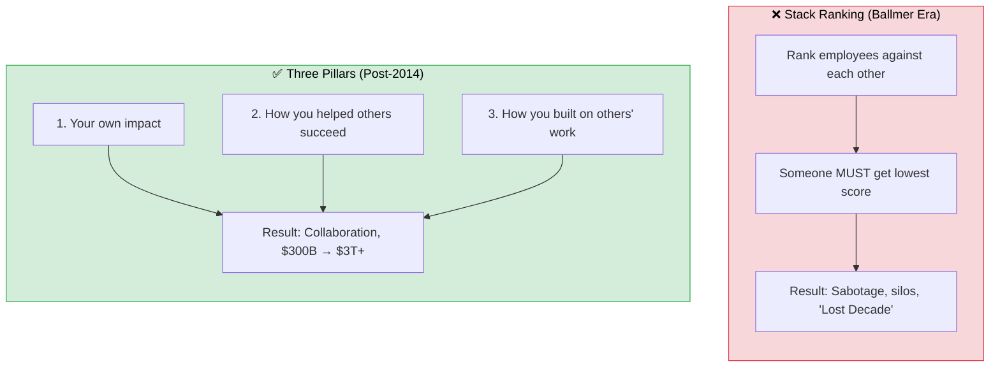
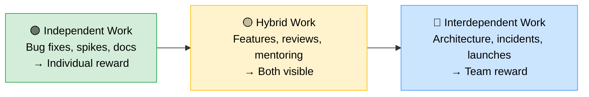

  

A debate breaks out among leaders. The team just shipped something significant. Someone suggests giving "champion points" to the person who drove it. Someone else pushes back — *"It was a team effort. Reward the whole team."* A third person raises the obvious: *"If we reward everyone equally, what's the incentive to go above and beyond?"*

I've been in this room. It was equal parts funny and frustrating — everyone had a strong opinion, everyone had a good argument, and nobody was wrong. That's the problem.

This isn't a values debate. It's a design problem.

<!-- truncate -->

## The Case for Rewarding the Team

  
👥

  

    "The system produces the outcome. Why are we rewarding individuals as if they're independent actors?"
  

  
Deming · Navy SEALs · All Blacks · Kohn

Let's start with the strongest arguments for team-level rewards — because they're genuinely compelling.

**[W. Edwards Deming](https://deming.org/dr-deming-called-for-the-elimination-of-the-annual-performance-appraisal/)** — the father of quality management — argued that **94% of performance variation is attributable to the system, not the individual**. He was talking about manufacturing, but the principle scales: in software, the system (tooling, process, team composition, codebase quality) shapes individual output more than we admit. The person who "drove" the feature had a designer who shaped it, a QA engineer who caught the edge cases, a platform team that kept the infrastructure alive, and a product manager who cleared the path. Rewarding one person for a system output is like giving the trophy to the striker and ignoring the midfield.

A [meta-analysis of incentive programs](https://www.researchgate.net/publication/227519897_The_Effects_of_Incentives_on_Workplace_Performance_A_Meta-analytic_Review_of_Research_Studies_1) found that **team-directed incentives had a markedly superior effect on performance compared to individually-directed incentives**. The overall average effect of all incentive programs was a 22% gain in performance — but team incentives outperformed individual ones consistently.

Then there's the **Navy SEALs**. [Simon Sinek describes](https://www.youtube.com/watch?v=kJdXjtSnZTI) a conversation with the training director for SEAL Team Six. They evaluate candidates on a 2×2 matrix: Performance (vertical) vs Trust (horizontal). The finding?

> **They'd rather have medium performance and high trust than high performance and low trust. Every time.**

The toxic high performer — brilliant on the battlefield, corrosive off it — gets cut. The highest-performing organisation on earth explicitly chooses team cohesion over individual brilliance.

The **New Zealand All Blacks** — 77% win rate over 100+ years, the most successful sports team in history — formalised this as the **["No Dickheads" rule](https://en.wikipedia.org/wiki/New_Zealand_national_rugby_union_team#Culture)**. If a player undermines trust, ability stops mattering. They're out. After every match, the most senior All Blacks sweep the locker room. No one is above the team.

**[Alfie Kohn](https://alfiekohn.org/punished-rewards/)**, in *Punished by Rewards*, goes further: extrinsic rewards don't just fail to motivate — they actively *undermine* intrinsic motivation. "Do rewards motivate people? Yes. They motivate people to get rewards." When you dangle individual bonuses, people optimise for the bonus, not the work. They take fewer risks. They hoard knowledge. They avoid helping others because helping others doesn't show up on *their* scorecard.

The evidence is clear: **when work is interdependent, individual rewards destroy the cooperation that makes the work possible.**

## The Case for Rewarding the Individual

  
🏆

  

    "If the reward comes regardless of my effort, why give 100%?"
  

  
Ringelmann · Sucker Effect · Recognition Paradox

Now the other side — because ignoring it is how you lose your best people.

**[The Ringelmann Effect](https://en.wikipedia.org/wiki/Ringelmann_effect)** (1913): when people pull a rope together, individual effort decreases as group size increases. In a group of eight, each person exerts only about half the force they would alone. This isn't laziness — it's a rational response to diffused responsibility. If the reward comes regardless of my effort, why give 100%?

This creates the **[Sucker Effect](https://en.wikipedia.org/wiki/Social_loafing#Sucker_effect)**: high performers observe free riders getting the same reward for less effort. They feel exploited. They reduce their own effort to match — or they leave. [Research consistently shows](https://www.forbes.com/sites/markmurphy/2025/06/25/are-your-best-employees-the-ones-most-likely-to-leave/) that high performers are often the *most likely* to leave, partly because their exceptional work becomes "expected" rather than recognised.

The **Recognition Paradox**: managers spend disproportionate time coaching struggling employees, while high performers get less attention because they "don't need it." The result? The people carrying the heaviest load feel the least seen.

There's also a practical reality: **not all work is equally interdependent**. Some tasks genuinely are individual — a brilliant architectural insight, a solo debugging session that saves the team days, a piece of documentation that nobody asked for but everyone uses. Pretending these contributions are "team efforts" is dishonest, and people know it.

Pure team rewards, applied uniformly, produce:
- Free riders who coast on others' effort
- Resentful top performers who update their LinkedIn
- A culture where mediocrity is comfortable and excellence is invisible

## Why Both Fail Alone

Here's the payoff matrix. If you've read the [game theory post](/blog/game-theory-engineering-collaboration), this will look familiar:

| | **Team Rewards Only** | **Individual Rewards Only** |
|---|---|---|
| **High Performers** | Feel exploited → reduce effort or leave | Thrive short-term → hoard knowledge, avoid helping |
| **Average Performers** | Comfortable → no incentive to grow | Anxious → compete instead of collaborate |
| **The System** | Social loafing, sucker effect, talent drain | Prisoner's Dilemma, silos, trust erosion |

Neither is a stable equilibrium. Both produce outcomes nobody wants.

*(Microsoft's "Lost Decade" is [well-documented](https://www.vanityfair.com/news/business/2012/08/microsoft-lost-mojo-steve-ballmer) — stack ranking was the poster child for individual rewards gone wrong.)*

The question isn't "team OR individual?" The question is: **what does the work actually require?**

## The Answer: Match the Reward to the Work

  
⚖️

  

    Not "team OR individual." Match the reward to the work structure.
  

The companies that get this right don't pick a side. They ask a different question:

> **"What behaviour does this reward produce, given the structure of the work?"**

- If the work is interdependent and you reward individuals → you get competition where you need cooperation
- If the work is independent and you reward the team → you get free riders and resentful stars
- If you match the reward to the work structure → you get the behaviour the system actually needs

This isn't theory. It's what the best-performing organisations have converged on. Here are four cases — each solving the same problem differently.

### Case 1: Microsoft — [The Clearest Before/After](https://www.vanityfair.com/news/business/2012/08/microsoft-lost-mojo-steve-ballmer)

Under Steve Ballmer, Microsoft used **stack ranking** — pure individual rewards. Employees were ranked against each other. Someone *had* to get the lowest score, regardless of team performance.

The result? Engineers actively avoided joining teams with strong people (because they'd rank lower by comparison). They sabotaged each other. Collaboration died. Vanity Fair called it Microsoft's "Lost Decade."

Microsoft abolished stack ranking in late 2013 under Ballmer's "One Microsoft" reorganisation. Satya Nadella, who became CEO in early 2014, then built the replacement system around **three pillars**:

1. **Your own individual impact** — what you shipped
2. **How you contributed to others' success** — the collaboration factor
3. **How you leveraged others' work** — the "One Microsoft" principle

That's literally "reward individual AND team contribution, weighted by interdependence." Microsoft went from ~$300B to $3T+ market cap. The culture shift is widely credited as a key driver.

Correlation isn't causation — Microsoft's market cap growth was driven by cloud strategy, not just culture. But the culture shift removed a *barrier* to the collaboration that cloud strategy required. You can't build Azure across dozens of teams if those teams are ranked against each other.

### Case 2: Google — Layered Recognition

Google runs multiple reward mechanisms simultaneously:

- **Peer bonuses** — any employee can nominate any other for a cash bonus. This makes *contribution to others* visible without waiting for a manager to notice.
- **Team awards** — for shipping something that required genuine collaboration
- **Promotion committees** — independent panels review evidence of impact, including peer feedback. You can't get promoted purely on solo output.

Peer bonuses require manager approval and are capped per quarter — the friction makes gaming not worth the reputational cost. The bigger risk isn't gaming; it's that extroverts get nominated more than quiet contributors who do equally valuable work. That's why peer bonuses work best as *one layer* in a system, not the whole system.

The design principle: individual recognition for *how you helped the team*, team recognition for *what the team shipped together*.

### Case 3: Navy SEALs — Both, But Trust Is Non-Negotiable

We covered the SEALs' trust-over-performance stance earlier. But their *reward structure* is worth looking at separately.

They still *measure* individual performance. They still have rankings. But they refuse to reward performance in isolation. Performance without trust is a net negative.

The reward structure:
- **Team membership** is the baseline reward (you stay on the team)
- **Individual excellence** is recognised on top
- **Individual excellence without team contribution** = you're gone

### Case 4: Toyota — Ideas Are Individual, Outcomes Are Team

Different industry, same insight. Toyota splits the reward by *what's being rewarded*.

Toyota's suggestion system has generated **50 million+ ideas** over 70 years (averaging 14.4 suggestions per employee per year). The reward structure:

- **Individual recognition** for suggestions — small monetary + symbolic rewards
- **Team-level bonuses** tied to quality, delivery, and safety metrics
- **No individual performance ranking** — evaluation includes how you develop others

The principle: individual *ideas* are rewarded (because ideation is independent work), but *outcomes* are rewarded at the team level (because execution is interdependent).

## The SDLC Spectrum: Not All Work Is Equal

Here's the thing most reward debates miss: **software development isn't one type of work.** It's a spectrum of interdependence. And the reward structure should follow that spectrum.

| Work Type | Interdependence | Reward Should Be... |
|---|---|---|
| **Isolated bug fix** | Low | Individual |
| **Technical spike / POC** | Low | Individual |
| **Documentation** | Low-Medium | Individual (the value is team-wide, but the act is solo) |
| **Code review** | Medium | Individual recognition for team-enabling behaviour |
| **Feature implementation** | Medium-High | Hybrid — individual contribution visible, team ships together |
| **Architecture decisions / RFCs** | High | Team — no single person "owns" an architecture |
| **Mentoring / onboarding** | High | Individual recognition for team-multiplying work |
| **Platform / shared library work** | Very High | Team — the value is diffuse, everyone benefits |
| **Incident response** | Very High | Team — rewarding the "hero" incentivises heroics over prevention |
| **Product launch** | Very High | Team — cross-functional by definition |

The pattern:

In practice, most work sits in the ambiguous middle. A "feature implementation" might be 90% one person's effort or 90% coordination — it depends on the feature, the team, and the codebase. The point isn't to classify perfectly. It's to *ask the question* before defaulting to one approach. The table is a starting point for the conversation, not a lookup table for the answer.

**The more coordination the work requires → the more the reward should be team-based. The more it depends on individual judgment → the more it should be individual. Always: make the contribution visible.**

## Back to the Champion Points

So — should the champion points go to one person or the whole team? Ask what was shipped:

- **Solo technical breakthrough** — a debugging insight, a performance optimisation, a piece of tooling that one person built → reward the individual. Make it visible.
- **Team delivery** — a feature that required design, engineering, QA, coordination, and cross-team dependencies → reward the team. The "driver" had a team that made driving possible.
- **Both** — and it usually is → do both. Recognise the individual's *specific contribution* publicly ("Priya's caching strategy saved us 40ms on every request") AND reward the team for shipping ("The checkout squad hit their Q1 target").

It's not "team OR individual." It's "what does the work structure tell us about where the value was created?"

## The Design Principles

If you're building a reward system — or arguing about one in a leadership meeting — these are the principles the evidence supports. Pin this to the wall.

| Principle | Why It Works |
|---|---|
| **Match reward to interdependence** | Interdependent work + individual rewards = broken cooperation. Independent work + team rewards = free riders. |
| **Make contribution visible always** | Even in team rewards, people need to feel *seen*. Visibility ≠ competition. It's recognition. |
| **Reward the behaviour you want repeated** | If you reward heroics, you get more fires. If you reward prevention, you get fewer. |
| **Never reward performance without trust** | The Navy SEALs principle. A brilliant jerk is a net negative. |
| **Separate recognition from compensation** | A public "thank you" and a bonus serve different purposes. Don't conflate them. |
| **Let peers recognise peers** | Managers see 20% of what happens. Peers see 80%. Google's peer bonus system works because it captures the invisible. |

## What You Can Do Tomorrow

One caveat before the action table: if Team A does highly interdependent work and gets team rewards, while Team B does independent work and gets individual rewards, you risk creating a two-tier system. The star on Team A who could earn individual recognition on Team B feels penalised for their team assignment. You need org-level consistency in *how* you assess interdependence, or you'll just move the unfairness from one dimension to another.

| Role | Action |
|---|---|
| **Engineer** | Publicly credit the people who unblocked you. Make the invisible visible. |
| **Engineer** | When you get individual recognition, name the team context that made it possible. |
| **Engineer** | Propose a peer recognition channel in your team's Slack/Teams — make visibility a system, not just good intentions. |
| **Engineer** | When the team disagrees about who "drove" something — that's a signal the work was more interdependent than anyone admits. |
| **Tech Lead / EM** | Before giving champion points, ask: "Was this independent or interdependent work?" Let the answer guide the reward. |
| **Tech Lead / EM** | Add "how did you multiply others?" to every performance conversation. Microsoft's second pillar. |
| **Tech Lead / EM** | Recognise the *type* of contribution, not just the *size*. A great code review is worth celebrating even if it's not a feature. |
| **Director+** | Audit your reward system against your work structure. If 80% of your work is interdependent but 100% of your rewards are individual, the math is broken. |
| **Director+** | Stop asking "who deserves the reward?" Start asking "what behaviour does this reward produce?" |
| **Director+** | Build the Microsoft three-pillar model: individual impact + contribution to others + leveraging others. |

## The One Takeaway

You don't have a "team vs individual" problem. You have a **design** problem. The reward structure is a feedback loop — it produces behaviour. If you're getting the wrong behaviour, you've designed the wrong loop.

  
💡

  

    Stop asking "who deserves the reward?" Start asking "what behaviour does this reward produce?"
  

The best teams — SEALs, All Blacks, Microsoft post-Nadella, Toyota, Google — don't pick a side. They match the reward to the work. They make contribution visible. They refuse to trade trust for performance.

The champion points? Give them to the person when the work was theirs. Give them to the team when the work was shared. And always, always make the contribution visible — because the worst outcome isn't giving the reward to the wrong person. It's making someone feel invisible for work that mattered.

---

*This post connects to the [game theory series](/blog/game-theory-engineering-collaboration) (why cooperation breaks down under individual incentives), [The Price of Anarchy](/blog/why-everyones-busy-but-nothing-ships-faster) (local vs global optimisation), and [The Luck Paradox](/blog/the-luck-paradox) (the egocentric bias that makes everyone overestimate their own contribution). The research draws from [Deming's systems thinking](https://deming.org/deming-on-management-performance-appraisal/), [Alfie Kohn's Punished by Rewards](https://alfiekohn.org/punished-rewards/), and [Daniel Pink's Drive](https://www.danpink.com/books/drive/).*
